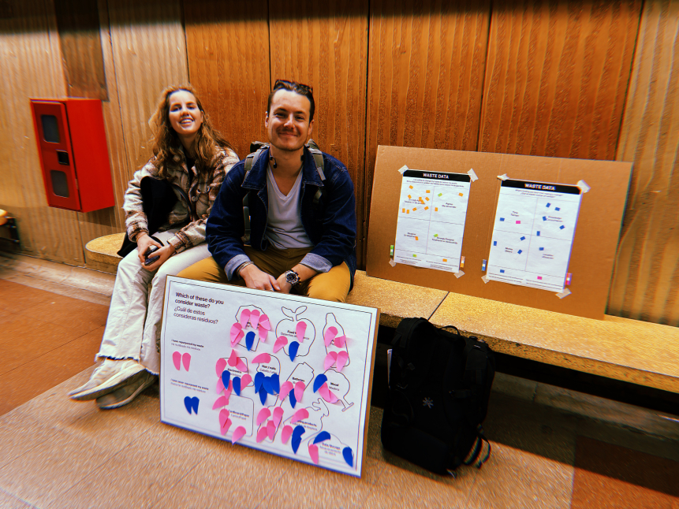

hide:
    - toc

# Design Intervention: What is waste?

## Collective Design Space activity
The group Design Space was somewhat chaotic. Although many of us shared an interest in repurposing waste and agreed that waste doesn't necessarily mean something worthless, our understanding of materials and waste was quite disorganized. We all acknowledged the need for a mindset shift towards recycling at home, and recognized the lack of awareness about waste management practices. We especially pondered the stark contrast in the availability of recycling bins in Barcelona compared to other European countries. Additionally, we emphasized the value and potential reuse of waste materials, sparking discussions about alternative material applications.

While our collective understanding was generally aligned, each of us had specific focal points; some were solely interested in coffee, others in materials affecting the ocean, and some in plastics. Consequently, it was challenging to concentrate the Design Space's focus on a single material for our workshop, which was initially intended to demonstrate how to repurpose waste and generate new materials.

Despite the complexities, engaging in the Design Space group was an enjoyable experience. We shared various articles and recommended different resources to each other, fostering a collaborative environment for expanding our knowledge. Moreover, this exchange allowed us to discover other projects and topics of interest among our classmates, which we could also integrate into our own Design Space.

<iframe width="768" height="432" src="https://miro.com/app/embed/uXjVNZ6tXgw=/?pres=1&frameId=3458764567644256010&embedId=107239734492" frameborder="0" scrolling="no" allow="fullscreen; clipboard-read; clipboard-write" allowfullscreen></iframe>

## Reflection of our group work
{style: width="480", align=right}
At first, we were very excited about setting up a workshop that focused on finding new ways to reuse our domestic waste. We were especially interested in exploring how to make new things from organic materials. We started the project with a lot of enthusiasm but didn't look into the best ways to actually repurpose these materials or what others had already figured out. This meant we didn't realize there was an extensive reservoir of untapped knowledge and resources available on the subject of repurposing waste materials, be it organic or synthetic.

When we tried to put this knowledge into practice, we ran into some unexpected problems. ot only did we struggle to enjoy the process, but we also realized that our approach lacked a comprehensive understanding of the broader implications of waste management and sustainable practices. This made us take a step back and rethink about what we originally wanted to achieve. We started to wonder if what we were doing was actually helping.

Consequently, we decided to try a different approach by creating an interactive survey as an intervention. We encouraged participants to reflect on their personal definitions of waste and their daily waste management habits, we sought to foster a deeper understanding of the underlying attitudes and perspectives driving individual actions. The survey showed us that people have different ideas about how to manage waste. Some think that repurposing things is a key part of recycling, while others aren't as sure and think we need to teach more about how to handle waste properly.

**This experience has solidified my belief that not everything falls solely on the individual's responsibility. There is a need for legislative changes and government and community involvement, as well as the creation of accessible pathways for people to adopt sustainable practices and for cities to become more environmentally friendly. Therefore, it's not just about conducting workshops on how to recycle materials, as this information already exists. The issue lies in the execution, which is hindered by the community and the current governmental structure.**

<iframe width="560" height="315" src="https://www.youtube.com/embed/aKyXh8QY6So?si=MSxFRkc9tKDAKlNc" title="YouTube video player" frameborder="0" allow="accelerometer; autoplay; clipboard-write; encrypted-media; gyroscope; picture-in-picture; web-share" allowfullscreen></iframe>

## Personal Design Space updated
Personally, I enjoyed this activity, but I've realized as a designer that my goal of creating change has shifted. I now understand that materials already exist, solutions are in place, and technologies are available. What's needed is a specific focus and a societal shift. This involves changing our mindset, making sustainable choices easier, and ensuring recycling becomes a simple task. This intervention has made me aware that sustainability will always be a part of my life and remain a priority. However, as a designer, my interest has evolved. It's no longer about solely creating new materials or solving all the world's problems. It's something I'll always consider when crafting objects and generating new ideas, but it's no longer my primary focus or dedicated pursuit.

Similarly, having reached this conclusion through this intervention, my question now is, **what is my main interest as a designer?** It's a challenging question to answer because I believe sustainability will always be at the heart of my work as a product designer. However, after starting this master's program, I've come to realize that my interests extend beyond just the product itself to my personal inclinations. One area I've yet to explore in my design space is my passion for food, which can also be tied to sustainability. I'm also keenly interested in mental health, equality, and technology. I feel a strong inclination towards exploring mental well-being and would like to delve deeper into this area. Moreover, to make the most of my master's degree and to contemplate mental health in the future, I aim to utilize today's technologies to enhance the field of psychology.

Furthermore, **I want to focus on my identity and the identities of others, examining the implications of technology on a person's identity today. I am interested in understanding how this impacts our daily lives and how we have become reliant on technology. This decision has emerged from this intervention and a recent seminar that underscored my interest in exploring people's identities, their mental well-being, and their relationship with technology and dependency.**

### My new Design Space

