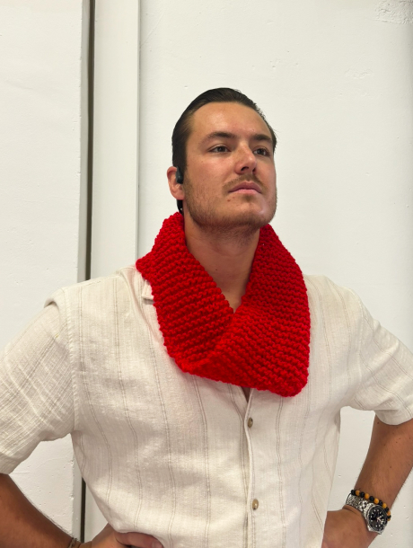

hide:
    - toc

# Personal Narratives

## Deliverable
**Individual**
{style: width="380", align=right}

The figure that a choose for a personal narrative was a ==blanket==.
I chose it because it reminds me of a personal time when I really needed comfort, especially during my period. The blanket represents my strong desire for warmth and safety when I feel extra sensitive. I used this everyday object to show the close link between how I feel inside and the need for a safe and cozy space. The blanket becomes a symbol of comfort, like a retreat where I can find peace. In sharing my story through this metaphor, I wanted to highlight how our deepest feelings connect with simple things around us, things we might not always notice but that give us a sense of security and comfort.

**Grupal: The Narrative of our group**

For the group exercise we gathered around the class as Laura initiated the activity by crafting a fennel stitch with a red thread in her hand. The task involved passing the thread among all of us, carefully weaving a network that mirrored our collective experiences and reflections on the master program over the past weeks. The outcome manifested as a unified web of red threads, symbolizing our interconnectedness and serving as a visual narrative of our shared journey in the master's program.

 > I took the freedom of taking the string and make a circular scarf out of it. In that way we will all collectively be together as a group and our narrative will be connected. The scarf is in our class, to keep anyone in the class warm if needed.

From the shared experiences we ended up writing a collective story about the narrative of the masters program.

<iframe name="embed_readonly" src="https://pad.riseup.net/p/r.191b285ac7f05571bdbdbd861fc19c67?showControls=true&showChat=true&showLineNumbers=true&useMonospaceFont=false" width="100%" height="600" frameborder="0"></iframe>