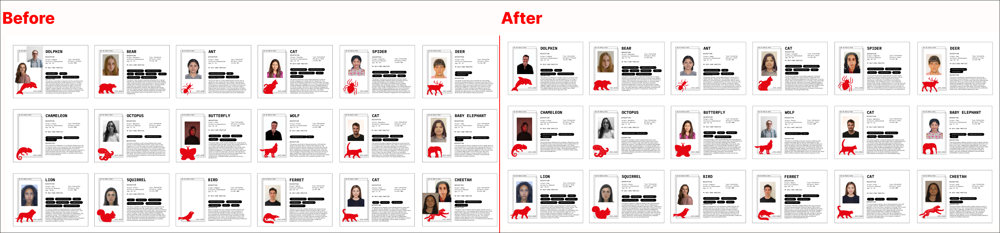

hide:
    - toc
# Second Intervention

## What, so what, now what? from my first intervention

In my initial expectations for the intervention, I aimed to create a community focused on improving the environment, with me in a role of assistance and providing answers. However, I quickly realized that this approach, where I held the power to solve problems, wasn't effective. I came to understand that true learning occurs when there's a mutual exchange of information rather than one-way instruction.

My interest shifted from the environmental focus to a fascination with the communicative aspect of the intervention. It became clear that our main contribution was facilitating reflection, not imparting solutions. This realization led me to abandon the desire for a powerful position and to appreciate the value of conversation and understanding within a community.

**The theme I'll explore moving forward is quite different from my initial expectations. Essentially, I aim to move away from the role of being a problem-solving designer who holds all the answers. Instead, I want to immerse myself within a community, both contributing to and learning from it. I might serve merely as a catalyst for reflection or not at all. There's a possibility that I'll gain more insights from others than they do from me. What matters most to me is the realization that the future is happening now – technologies are already available, and what we truly need is a shift in societal perspectives. Consequently, my focus will revolve around society, existence, and identity – delving into questions about who we are, what we are, why we exist, and what we aspire to achieve with that understanding.**

## Design Intervention: Social Identity
### Our Intervention
For the next intervention, I connected with Sophie and Nuria to explore our shared interests in social media and the online world, particularly examining their impact on our identities. This became our Collective Design Space:   

In this intervention, our primary goal was to prompt our classmates to engage in thoughtful introspection about their digital identity—considering both how they are currently perceived by others and how they aspire to be perceived. Given that our generation has grown up in a digital era, our online presence has become an integral part of our personal identity. We've become accustomed to presenting ourselves within the constraints of various platforms, often utilizing a combination of text and images. However, we posed a critical question: **Is our Instagram account, or any other digital representation, an authentic reflection of who we truly are?** To explore this, we collaborated with classmates, fostering a collective space where we encouraged them to reflect on their self-perception based on their online identity and the impressions that strangers made of them in the digital realm.

In order to make that happened we did the following steps:
> 1. We asked our classmates for permission to show their Instagram profiles to our friends.
> 2. We created a survey with very specific and limited response questions in order to have the same model with everyone. The questions were such as: Identify this persons sexuality, origin, recycling habits, travelling habits and self-care practices.  

> 3. We shared the social media profiles and asked our friends to fill out forms about each profile. Each profile was looked at only one time, so each classmate only got one digital identity. Different friends of ours assisted in examining our classmates, so it's crucial to understand that every digital identity we created depends on their personal opinions. Each person had different criteria for determining what was important in identifying that person.  

> 4. We gathered information on the profiles and organized them into anonymous cards to prepare for the game.
> 5. We invited our classmates to engage in a participatory exercise where they were prompted to associate themselves with one of the profiles exhibited on the wall. They were then requested to affix their respective photographs onto the corresponding profile card. This interactive initiative not only facilitated meaningful conversations regarding individual self-perceptions but also yielded valuable insights into how participants perceive themselves within the framework of our collaborative project.  

> 6. We then revealed the final solution  that matched each profile to its respective individual and documented their responses. 

>7. We conducted interviews to ascertain whether individuals identified with the descriptions provided by our friends.

<iframe width="560" height="315" src="https://www.youtube.com/embed/OIIXZlqX_4c?si=GkukhdTO6wV7FD9F" title="YouTube video player" frameborder="0" allow="accelerometer; autoplay; clipboard-write; encrypted-media; gyroscope; picture-in-picture; web-share" allowfullscreen></iframe>

### Reflection
In retrospect, there are a few things I would have done differently in this project. For instance, we overlooked a question, specifically one about political opinions derived from Instagram accounts, which we found particularly interesting. I also believe we should have granted more freedom to our friends in their judgment. Instead of providing limited options for certain questions, such as the number of books they read, we should have allowed more subjective responses. This would have avoided generating similar profiles, making users appear less diverse. **It would have been better to let people judging these profiles respond with more subjective questions or give them the freedom to say what they wanted. For example, asking them to judge their interests, how they perceive that person, whether they think the person is cheerful, sad, energetic, calm, their zodiac sign, etc. This approach would have allowed for more creativity rather than creating rigid profiles.**

Nevertheless, I really enjoyed this project, and I believe both we and our classmates had a good time. It proved to be a valuable exercise, as everyone appreciated gaining insights into how others perceive them based on their social media profiles. Many were intrigued to view their Instagram profiles from different perspectives. Some even expressed uncertainty about whether they truly reflected certain characteristics, prompting them to revisit their own profiles for self-reflection. **This fun exercise has sparked my interest in expanding my research on the concept of identity and how we perceive ourselves.**

## NOW WHAT?
{style: width="380", align=right}

Reflecting on this exercise, while enjoyable, the reflective aspect didn't unfold as expected. People realized their Instagram profiles didn't precisely convey what they intended. Despite having a good time, we didn't draw as deep conclusions as anticipated. Social media has become a passive exercise ingrained in the need to express ourselves, with few truly reflecting on their Instagram presentations.

The exercise intrigued individuals with Instagram accounts, sparking curiosity about how others perceive them. However, the desire for validation through social media profiles should be questioned. It would have been beneficial to reflect more on individuals' feelings, intentions, and whether their social media profiles truly represent them. We've grown accustomed to using these platforms as tools without questioning our motives.

**While the exercise was good, it remained somewhat on the surface. The answer that people do not perceive us as we perceive ourselves on social media wasn't surprising. Now, the challenge is, "What do we do with this information?" What have I gained from this intervention? It's about more than just reflecting; it's delving deeper into understanding identity, social media, and entering the world of thoughtful contemplation on these topics.**

This intervention marks my initial step into the new theme I want to explore in this master's program—identity, social identity, and notably, the intersection with mental health. I aim to delve beyond just discussing social media, althought it is important to our generation's identity.

This week's exercise is a foundational exploration of who we are, how we perceive ourselves, and how we present ourselves to others. While I am uncertain about its direct impact on my future career, I see it as a crucial skill to cultivate—becoming a catalyst for reflection rather than a simple problem-solving designer. I'm eager to explore this further, particularly in a social context, to understand its broader societal implications.

Moving forward, I want to delve into subjectivity because, ultimately, one's identity and mental health are deeply personal. This exercise is my initial foray into something greater. **Now that I understand how we present ourselves, I aim to reflect more on my own identity, its impact on others, and how it affects me. My main question going forward is how to involve communities, making them an integral part of this individual exploration.**

