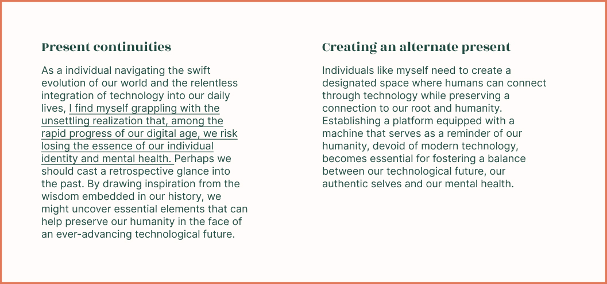
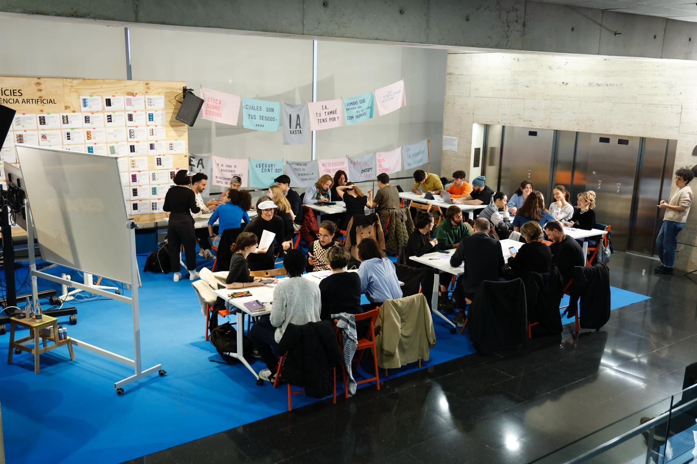

hide:
    - toc

# Ways of Drifting & Intervention 

## Ways of Drifting

Throughout the course, I've noticed a tendency towards accumulative interventions. Each intervention has helped me focus my research on more specific topics. Initially, I explored waste management, asking people about their recycling habits and waste management practices. This led me to delve into the concept of communication. Once I identified what I wanted to communicate, I focused on the type of conversation I, as a designer, wanted to initiate. I became particularly interested in the concepts of identity and mental health. Consequently, I conducted two interventions: one on my phone dependency and self-identity, and another on how we present ourselves on social media. I engaged others in reflecting on social identity and our own identity in the context of technology. Subsequently, I delved into artificial intelligence during Design Dialogues, collecting data related to its impact on mental health and the creation of personal data for AI. Ultimately, I am nearing the concept of my thesis, which revolves around transhumanism and its implications for identity, humanity, and mental health. My aim is to take a communicative stance and prompt people to reflect on these issues.

As I continue to explore my project further, I will realize whether the drifting approach I have chosen is the right one. Initially, I thought my approach to interacting with projects was quite linear/serial, but I am increasingly noticing that from each intervention, I have extracted a theme that I have delved deeper into each time. It feels like I am getting closer to something more specific with each step. I am still not very clear if I have an accumulative or serial way of working, but considering that I am increasingly focusing on the concept of mental health, identity, and technology, I increasingly think it is accumulative.

## Intervention: We got to know AI & What makes us human?
For this project, we faced numerous challenges because our initial idea was to create an Artificial Intelligence clone of ourselves. Essentially, we wanted to explore whether we were ready to trust technology more than ourselves. **Our plan was to develop a clone that could speak, sound like us, and interact with us on a daily basis.** We would guide the bot by explaining our feelings or situations, expecting it to react and provide guidance. Our ultimate goal was to see if we could manipulate our own thoughts through a synthetic bot, as it would speak in our own voice. **However, as we proposed this idea, we quickly realized that we lacked the necessary tools and knowledge to create such a bot.** We weren't familiar enough with Artificial Intelligence and needed to learn more about it. Consequently, our project shifted into two weeks of intensive research and development into the realm of Artificial Intelligence. We explored various types of AI, including voice, text, and facial clones, while also delving into their inner workings. We aimed to understand their requirements, the data they extracted, and how they functioned. **Our goal was to gain a deeper understanding of Artificial Intelligence.**

*Exercise in class*

### Getting to know AI
#### Our research

We created a MiroBoard to break down the process of making a clone of ourselves and gather information about Artificial Intelligence and existing bots. This MiroBoard will be continuously updated with brainstormed project ideas, including references to projects of interest and various Artificial Intelligence options we want to explore, utilize, or build upon for other projects.

<iframe width="768" height="432" src="https://miro.com/app/live-embed/uXjVNzLbN80=/?moveToViewport=-1813,-1422,7288,3297&embedId=886535282466" frameborder="0" scrolling="no" allow="fullscreen; clipboard-read; clipboard-write" allowfullscreen></iframe>

#### AI workshop

{style: width="480", align=right}

Apart from that, I personally attended an Artificial Intelligence workshop where, essentially, as a group and with the help of Núria Nia and CItali Hernández, we collectively generated a series of data for an Artificial Intelligence system using a specific code. This process helped me grasp the workings of Artificial Intelligence from its fundamental code to its end result.**Additionally, I had the opportunity to network and engage with the creators of the code, who provided it for my use.** Consequently, this workshop not only deepened my understanding of Artificial Intelligence and its creation but also equipped me with the confidence to develop such tools from scratch and utilize the provided code for my own projects going forward.

 Núria Nia and Citali Hernández used Julia Múgica and Iván Perez' [code](https://github.com/TURBULENTE/ParloAutomaticament).

###  What makes us human?
####  Explanation
In the end, after all our research, we also came to realize the importance of addressing the question: **"What makes us human?"** As we delved into the intricacies of artificial intelligence and its functionality, we felt the need to explore whether humans are truly capable of distinguishing between artificial intelligence and human creations. **Therefore, our final intervention focused on analyzing and creating a test for people to respond to.** Essentially, we presented them with images, voices, or texts and asked them to determine whether they were generated by artificial intelligence or by humans. **Our goal wasn't to assess whether participants answered the test questions correctly or incorrectly, but rather to understand the criteria they used to differentiate between human and artificial creations.** We aimed to explore how humans write and speak compared to robots, and these were the insights we gained from our investigation.

The majority struggled to differentiate between artificial intelligence and humans, with most answers being incorrect by about 60 to 70 percent. People couldn't accurately discern between a human voice and one produced by a bot, nor could they distinguish between drawings, images, and texts. The test was deliberately designed to confuse participants, making them to think deeply and reflect. Many believed that bot-written texts are short, formal, and impersonal, with repetitive tones, indicating artificiality. However, when given a prompt mimicking a particular author's style, the AI produced a different tone, further confusing respondents. Most associated artificial intelligence with impersonality, formality, and repetition. Regarding images, people thought imperfections/glitches indicated artificiality, focusing on details like poorly drawn hands or overly detailed images. Creativity was also seen as a marker of human origin, though we were the ones promoting creativity. In terms of voice, most expected a monotone and robotic sound, but when pauses were human-like, confusion ensued. Overall, the inability to differentiate highlighted the challenge of identifying truly human characteristics in AI-generated content.

**In the end, what is commonly associated with Artificial Intelligence is often uncreative, overly perfect yet lacking in detail, very formal, impersonal, and less natural. In contrast, humans are creative, artistic, imperfect, with less refinement and more naturalness, using longer and more intricate phrases, and employing more personalized language. Ultimately, the reflection is that if we truly understand how to use this tool, we can also mimic this naturalness. Because behind the scenes, the person using this Artificial Intelligence can manipulate these outcomes. What defines our humanity is our imperfections and our natural and personal tone, so when we can imitate that, people struggle to differentiate between a human and AI.**
 This is the [survey](https://app.voiceform.com/to/KewddITIqUutaTI7) we sent.

*We are still receiving answers, so I'll keep updating the website and our conclusions.*

####  Reflection

The exploration into the boundary between human and machine intelligence shows how amazing AI has become at mimicking human output. It raises questions about what makes human creativity unique in the face of such advancements.

AI's potential challenges how we see authenticity and originality, making us wonder about the value of human creativity. Even though AI can copy us, human creativity remains special because of our quirks and emotions.

As AI becomes more a part of our lives, we worry about everyone becoming too similar and biases getting stronger. It's tough to keep our individuality as AI gets better at optimizing.

Our test showed it's hard to tell the difference between human and AI-generated content. In the end, what makes us human is our imperfections and personal touch, blurring the lines between what's human and what's AI.

