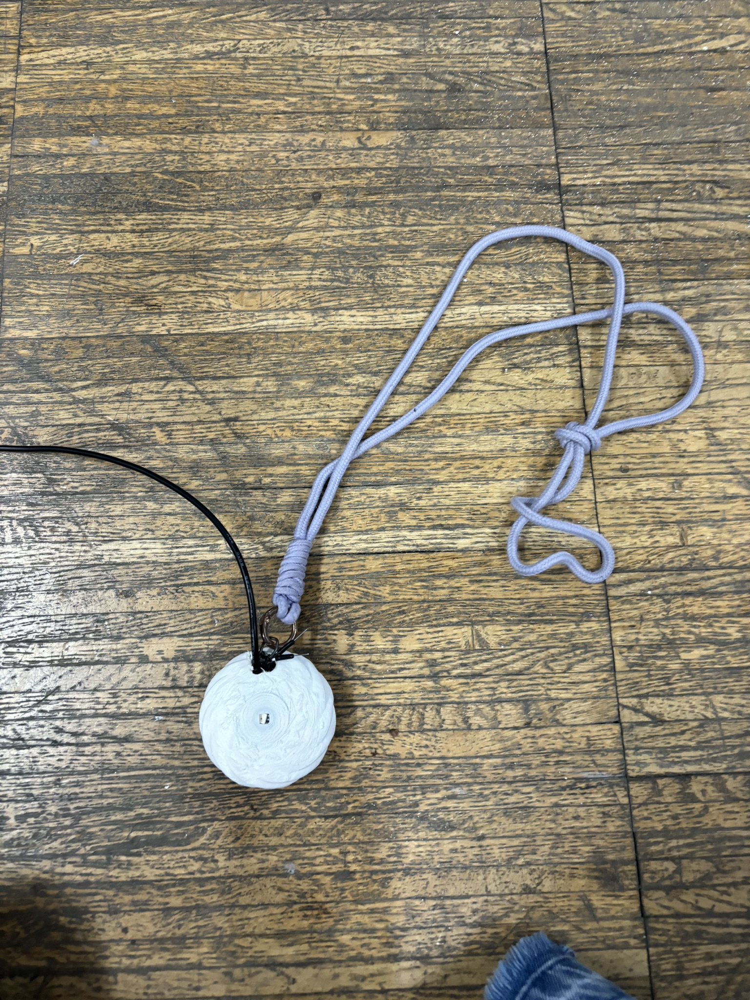
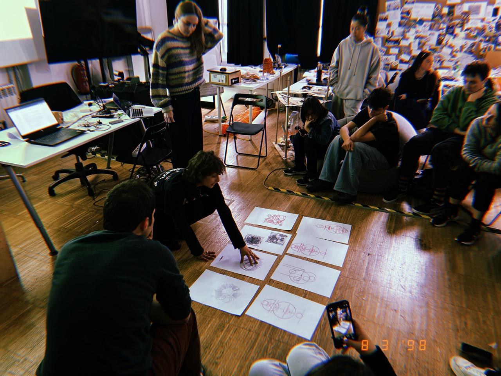

# Network of co-responsibility & Second Intervention 

## Second Intervention

### Anxiety Necklace
{style: width="480", align=left}

For my second intervention, I began with a clear objective: **to create a necklace designed to help manage anxiety. This project was my way of engaging with a community, aiming to develop a device that could assist a broad spectrum of people, spanning different ages, all struggling with anxiety**. I had two goals: first, to craft this device and wear it myself for a period, allowing me in a first person prespective to navigate the constant monitoring and analysis of my mental health. Secondly, I aimed to have others try it out, turning it into a form of human intervention.

Admittedly, my thesis focus wasn't inherently open to non-human elements, given its core emphasis on mental health. Yet, my overarching objective remained centered on human interaction and collaboration within a wider community, be it friends, family, or individuals with whom I could openly discuss mental health issues, using technological elements to manage mental well-being.

**However, during the initial stages of the MicroChallenge, I soon realized the complexity involved in creating the technology I envisioned. Thus, rather than solely assessing the impact of a technology meant to monitor and manage mental health, this intervention shifted towards the challenge of crafting the technology itself.**

In this second phase, I primarily engaged with the FAPLAB and IAAC communities to explore the specific creation of the envisioned necklace. Once activated by touch, this device would emit vibrations guiding the wearer through a breathing cycle to induce relaxation. The process was complicated, particularly due to the challenges of designing aesthetically pleasing components for wearable technology.

**I encountered numerous setbacks along the way, from learning to solder and code to navigating the use of unfamiliar elements. It was very challenging to deal with very small components because all fragile cables constantly broke. Ironically, the vibration aspect, intended for relaxation, ended up aggravating my anxiety through extensive testing. This led me to reconsider this feature for future iterations.**

Despite the obstacles, creating this necklace facilitated a deeper connection with the FabLab community. Their assistance in coding, testing, printing, and designing proved invaluable. I also gathered all their insights, especially considering the nuances of working with such small-scale technological products. 

### Next steps
While the project is ongoing with further prototyping, my aim remains to eventually apply it to benefit others. Crucially, I've come to the conclusion that the initial testing phase, when I first introduce the necklace to others, should be simpler. 

Essentially, the necklace detects signs of anxiety, such as fidgeting, and activates the breathing cycle to calm the wearer. Simultaneously, it communicates the wearer's anxiety to others through an LED indicator. This dual function serves to aid relaxation within the community while also facilitating awareness and understanding of anxiety in others.

This concept, though ambitious, faced challenges such as Wi-Fi connectivity and managing multiple elements simultaneously. Hence, my conclusions from this intervention are:

1. I should simplify the necklace to make it easy to install and monitor on others. For example: take out the wifi connection and just focus on a wearable that helps you calm down.
2. Explore alternative features beyond vibration.
3. Find ways to enhance durability in small-scale elements.
4. Involve a community capable of utilizing such devices.

At its core, the goal of this necklace is to manage and communicate anxiety, fostering open discussions and utilizing technology for effective management. I really hope I can accomplish that.

Check the [First Microchallenge: "Design of an anxiety necklaces"](https://github.com/carmenrobres/microchallenge1) and [Second Microchallenge: "Representing health"](https://github.com/annafedele/microchallenge-II) to see the development of this necklace and the way we portrayed anxiety and health through drawings.

## Network of co-responsibility

In both my first and second interventions, I've encountered challenges in engaging with communities. I've come to realize that this trimester, I've been heavily reliant on querying those around me, particularly teachers, as they possess the most knowledge on the subject I wish to explore: technology and artificial intelligence. In this second intervention, it's been classmates and members of the FABLAB community who've been instrumental in assisting me with creating these technologies. **Consequently, I must acknowledge that, in terms of community responsibility, I haven't effectively applied the concept of community interaction. My projects have been overly dependent on my ability to develop the technologies I wish to use, thus limiting my engagement to just the FABLAB and MDEF community. Had I been able to create the necessary technologies when required, I could have interacted with a broader range of communities.**

Overall, I believe my thesis lacks a direct connection to non-human elements and is clearly focused on what is human and essential to our identity. Mental health, in particular, is a universal concern, as is our interaction with technology in our daily lives and how it impacts our identity and self-perception. Therefore, as a designer and in terms of community responsibility, I feel I still need to create this community. My goal is to establish it with individuals who can openly discuss mental health and who may have some form of mental health issue. **Thus far, I believe that in the future, I will continue learning and researching how to create these technologies and the best ways to reach these communities. Once I've acquired the necessary knowledge to drive my project forward, I'll attempt to connect with individuals who have mental health issues and who would be interested in using my technological products for mental health. In this case, they would likely be friends and family, as I believe this topic requires a level of trust and openness to discuss.** Hence, in the immediate future, I believe that the individuals who can use my products and provide honest feedback about their efficacy are those who trust me and are comfortable discussing the topic and how it has affected them personally.

I also recognize the need to let go of some control and allow others to provide feedback. However, given the broad nature of mental health, I'll need to narrow my focus. **I must strive to establish a community comprised of individuals who experience anxiety and likely already have some relationship with technology in their daily lives, particularly those from Generation Z or millennials. I must find a way to connect with these individuals and generate some form of feedback loop to address their anxiety and the use of mental health tech.**

