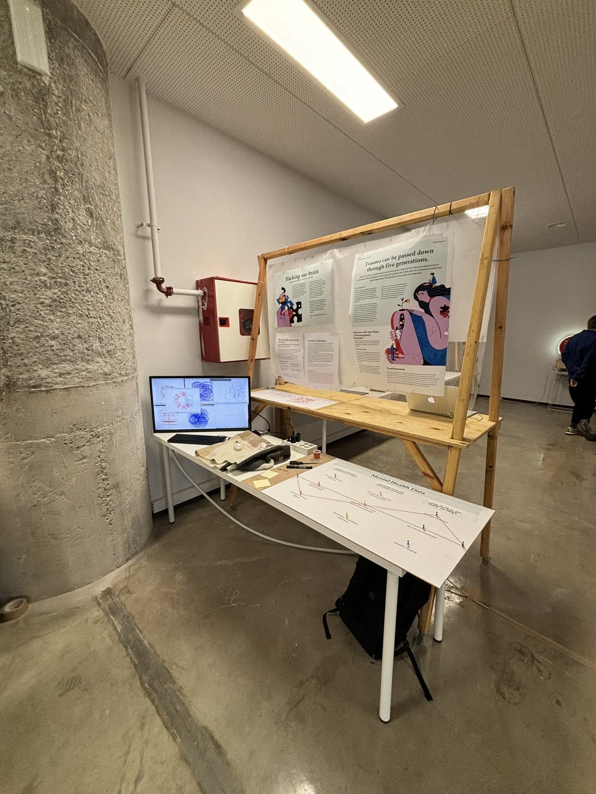

# Design Dialogues

## Reflection
{style: width="480", align=left}

The Design Dialogues served as a pivotal moment for me to hone in on the focus of my research. While previously discussing the broad concept of mental health, I gradually realized that the essence of my investigation, stemming from the Dialogues, centered mainly on anxiety and discovering relaxation methods. This revelation arose from discussions prompting me to acknowledge anxiety as the most immediate and reactive mental health challenge, thereby making it easier to develop technologies that respond to it. 

Furthermore, delving into the concept of learning to relax proved intriguing, especially as I engaged with diverse perspectives on textures, materials, and sensory elements conducive to relaxation, including vibrations, textures, and sounds. 

Following the Dialogues, I have an extensive reading list of recommended articles awaiting exploration. I am particularly keen to delve into the textures and materials that many find relaxing, aiming to identify the common elements that induce relaxation to redesign the design of my anxiety product. Additionally, I aspire to simplify the design of the necklace I conceptualized and experiment with different variations, such as one focused on connectivity, another on vibration, and one solely on tactile sensations.

While most participants found the topic intriguing yet complex due to its subjective nature when combined with technology, there was widespread interest in tangible applications of technology, exploring how electronics can amplify the subjective experiences of touch and personal well-being, ultimately aiding in mental health improvement. 

Furthermore, I received valuable recommendations for enhancing the necklace, including using biomaterials and integrating soft electronics. I am eager to delve into the recommended articles and continue refining the necklace design while exploring alternative techniques to leverage technology for mental health enhancement, considering the unique subjectivity of each individual. The fundamental question remains: do I create a necklace tailored solely to my own needs and mental health, or do I strive to accommodate a broader audience, seeking a collective solution in a realm where mental health lacks a universal point of convergence?

## Final Design Space

I am still reflecting on my Design Space... I need to read more and explore. For now I am confident on the fact that I want to work with technology, electronics and AI but I am still questioning the main focus. Working on mental health is a nice topic but it is starting to get a bit too serious, I either need to change the focus or start experimenting and acting... less research more interacting!

For now this is my DesignSpace before reading all the articles suggested on the Dialogues:

