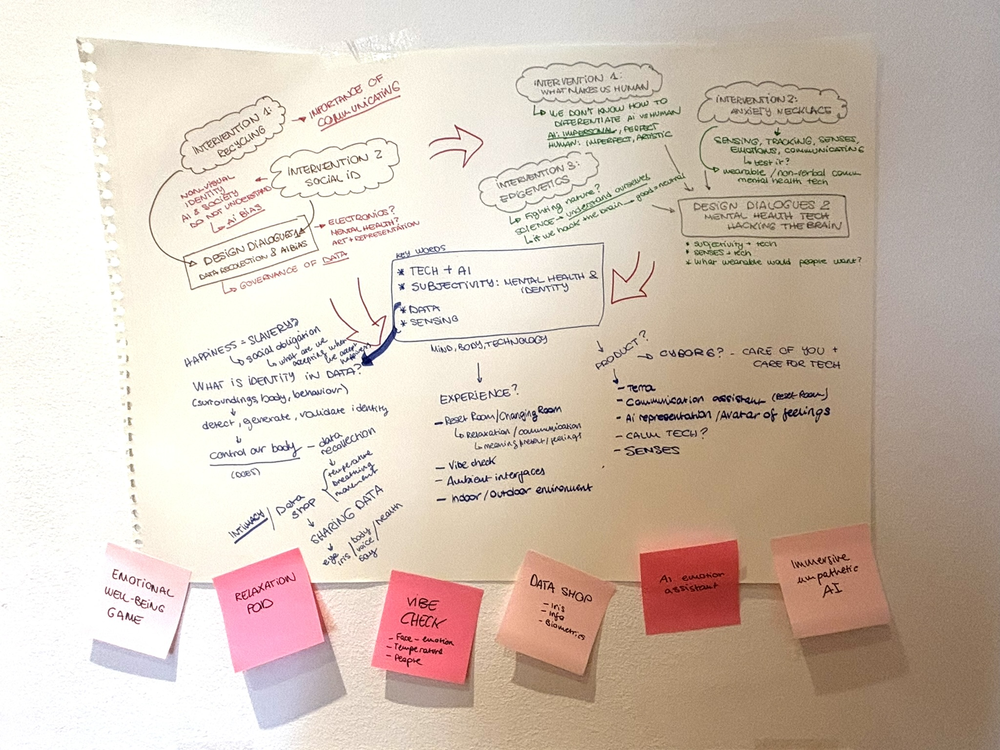
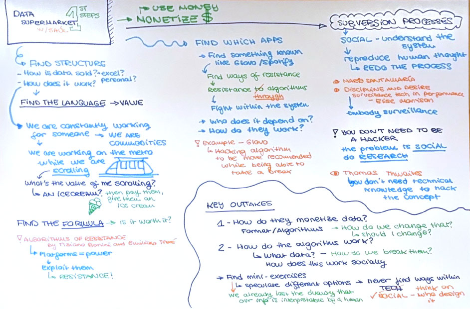
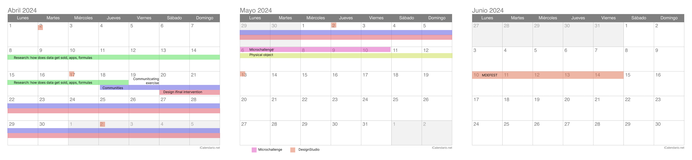

# First Intervention: Data Privacy

## Mapping my new research topic
> 9th of April
After the Design Dialogues and the Easter break, the focus shifted to the MDFest project for the remainder of the term. This realization initially caused some stress, **as I realized I didn't want to simply present an object aimed at addressing mental health. The exploration felt too subjective, and I lacked clarity on what the solution should entail or where I fit within the mental health concept.**

Moreover, during the Design Dialogues, I noticed that although many people find mental health topics interesting and important, it's not a subject people readily discuss or confront directly. Therefore, my intervention this week involved reflecting on what I wanted to do based on my progress throughout the year. **I mapped out my trimester's advancements, identifying key objectives and themes from each intervention to ideate my potential MDEFest presentation.** I considered various experiences, products, and objects I could create if given an empty room.

{style: width="480", align=left}

From this exercise, I brainstormed various ideas for MDF Fest, including a concept called the "data supermarket." While my focus this trimester centered on mental health, I found the topic complex and subjective, impacting both myself and those around me. Additionally, **I revisited the theme of data, sparked by insights from a book on transhumanism, which highlighted how we're becoming commodities traded as data by entities and companies.**

Considering these insights, I pondered exploring the notion of being a product in a digital world. This led me to conceive the idea of a data supermarket for the MDEFest, where individuals become the products. To guide me in this journey, I mapped my progress and established a timeline, which included conducting an brainstorming session with **Saúl Baeza. This interview provided valuable insights and propelled me toward exploring this theme further to refine my final concept for MDEFest on data privacy and identity-tech reflections.**

### Brainstorming With Saúl Baeza
- **Initial Idea Presentation:** The purpose of my interview with Saúl was to share my concept without prior research. Saúl, a creative individual with extensive experience in exploring similar themes, offered guidance on my next steps and potential directions. The interview lasted approximately an hour and was recorded for reference.

- **Key Insights and Advice:** Saúl emphasized the importance of monetizing my intervention for maximum impact. This involves incentivizing data sharing by promising monetary rewards to participants. Understanding the value and exchange mechanisms of data is crucial, along with identifying recognizable apps, such as those related to mental health, for targeted interventions.

- **Hacking the System:** Saúl illustrated strategies for subverting algorithmic recommendations, such as creating diversified YouTube accounts to counter geographic bias in content suggestions. He also highlighted examples of individuals leveraging loopholes in apps like Glovo to manipulate algorithms. These insights underscored the need to approach data privacy issues as social problems, requiring an understanding of system dynamics rather than technical expertise.

- **Key Takeaway:** Saúl's advice highlighted the importance of internal hacking and social awareness in addressing data privacy concerns. It's not just about coding skills but understanding the societal and communal roots of these issues to enact meaningful change. Developing a comprehensive understanding of data systems is crucial for effective intervention.

### Ecosystem actors
So far, my ecosystem actors have all been from the academic realm. **Now that I've just switched topics, I'm trying to find different communities that can help me co-create the intervention I'm envisioning.** Essentially, in my intervention, the only ecosystem actor involved so far has been Saúl, as he's the one who sparked the development of it. However, **I plan to collaborate with data protection companies, whether they are communities or private enterprises actively involved in data privacy.** I might also like to collaborate with companies involved in the policy aspect of data protection. Most importantly, the communities I want to engage with are those interacting with phones and technology elements that collect this data. Ultimately, **my priority now is to do some research and choose which application or interface I want to investigate, so I can then find the community using it and raise awareness about data usage and privacy.** Therefore, it's crucial for me to continue this brainstorming exchange with Saúl, identify the application I want to focus on, find the community interacting with it, and also discover data protection communities actively engaged in this fight and their strategies for raising awareness on this issue.

### Goals & Next Steps
My current goal is to find my niche and refine my thesis. I'll revisit foundational exercises, especially in communication, to shape my project's voice. I've shifted my focus to data privacy, but what's the purpose? I aim to experiment with interventions before MDEFest and seek solutions for the future. I'll pinpoint my exploration's scope, select relevant apps, and map out intervention strategies. I've outlined a one-month plan to develop my idea further. Now, I must delve deeper, anticipate future implications, and aim to benefit various communities.

### So what, Now what?
After speaking with Saúl, I've been reflecting more on my stance in this world regarding this issue. The concept of surveillance capitalism is undeniably complex, and the monetization of data prompts deep reflection. However, delving into this topic requires going beyond what I initially envisioned. From my limited research, it's clear that most people aren't fully aware of the extent to which their data is being collected. Therefore, while the Data Supermarket idea holds merit, there's a need to explore further the various apps and methods of data collection, as well as the type of knowledge generated from this data.

Ultimately, I must heed Saúl's advice to find my own battle – identifying which apps or types of information concern me the most. The crucial next step is finding ways to communicate and educate people about this issue. Subversion, as Saúl suggested, entails navigating within the system to resist this surveillance. However, my immediate task is to determine the nature of my fight and how to effectively communicate it, so people can understand and experience firsthand the impact of surveillance. Because, fundamentally, they're already being surveilled; they're just not aware of it. Therefore, my new goal is to create experiences that allow people to grasp and comprehend this issue firsthand, shifting the focus from indifference to active engagement.

