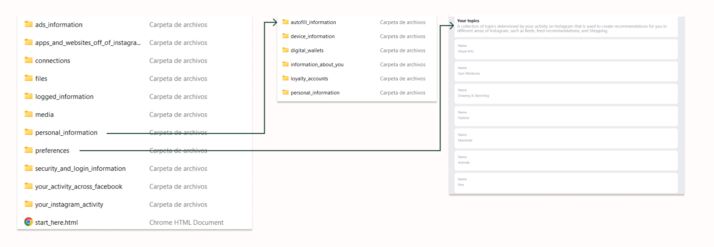
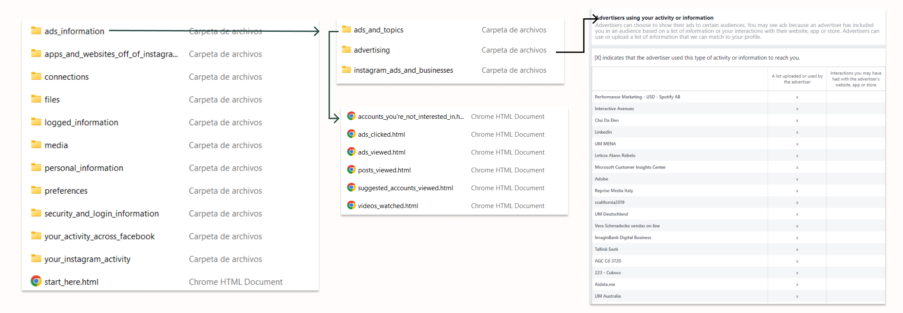
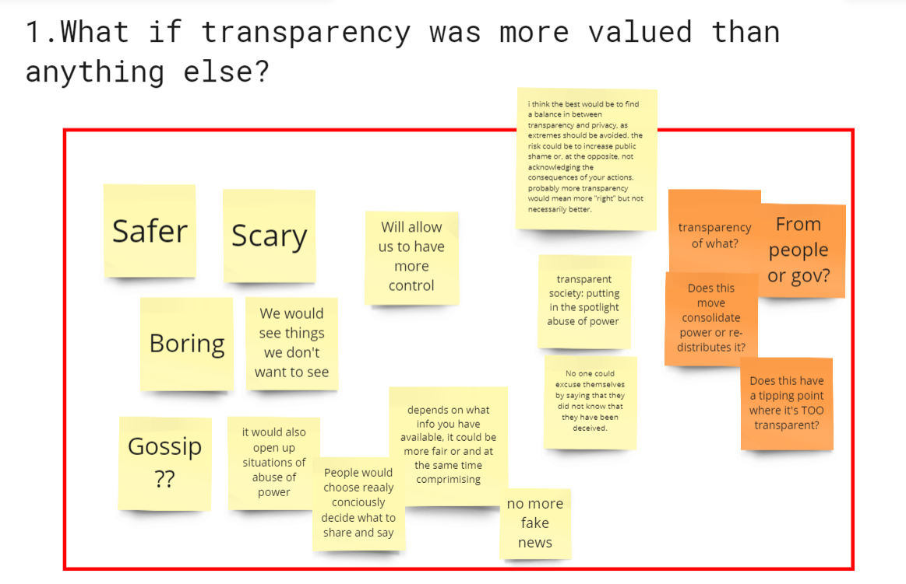

# Second Intervention: What in the world should I do for our privacy?

## Downloading my data from Instagram
> 15nd of April

My first exploration into the concept of digital privacy began with downloading my data from Instagram. Today, privacy laws have improved, and by law, all platforms must allow you to download all the data they've accumulated about you. In this case, I downloaded a year’s worth of data from Instagram and received a ZIP folder containing all the information.

From my prior research, I expected Instagram to have information such as my gender, age, location, the type of phone I use, all the images I’ve posted, liked, and interacted with. However, two specific aspects were particularly interesting. Firstly, there was a folder called Preferences, which listed topics that supposedly interest me. Amusingly, one of these was Gym Workouts, which I’ve never looked up, along with categories like mammals, animals, and pets. Despite these predictions, they don’t align with my actual interests.

Another folder contained my personal information, including my gender, age, autofill information, credit card details, and passwords—sensitive data I wouldn’t want Instagram to share.

The most important aspect for me was the topic of advertisements. My exploration focuses on how surveillance capitalism is used to influence our thoughts and actions. The Ads and Topics folder listed all the ads I’ve seen, clicked on, and accounts deemed uninteresting to me. While it makes sense for Instagram to track interactions to optimize ad revenue, it raised concerns for me. For instance, how long must I view a post before it’s categorized as interesting? How many seconds of interaction qualify as a like?

**More alarming was the Advertisement folder, which listed all the platforms and companies that have targeted me with ads. This included a list of advertisers, many of whom I couldn't identify. My initial thought was that these names might be encrypted to obscure the true companies behind them. However, after some googling, I discovered that many were individuals, not companies. This realization was unsettling, as it implied that behind Instagram, there are real people, not just companies, actively working to include me in their advertising campaigns and present ads to me for their benefit.**

>KEY TAKEAWAYS: This made me question many things, such as why ordinary people would want to appear in my Instagram feed. What images have they wanted to show me that I don't remember seeing? Or have they simply wanted to take my data for other purposes? This started to alarm me and also made me realize that during my exploration, I didn't mind Instagram having all this data about me or companies like Spotify or LinkedIn having my information. But once I saw the name of a person I didn't know on the advertiser list, I became concerned.
>So, in matters of privacy, **we don’t mind being monitored by platforms, but we do care when specific individuals know information about us. In other words, I don't mind if Google or Meta knows everything about me, but I do care if my neighbor knows this information. This raises the question: where is the line between the concept of privacy and the idea of consenting to shared information?**

## What if transparency was more valued than anything else?
> 22nd of April

My second exploration was more of an open community question where I essentially asked what would happen if the world were 100% transparent. We already live in a world where transparency is part of our identity. We judge people based on the amount of information they share online. For example, you're more likely to be hired by a company if you have a well-developed LinkedIn profile and good connections than if you don't exist in any online space. The same applies to Instagram: when you have to get to know someone or someone starts following you, you're more likely to trust this person if they have many shared images and followers compared to someone with only 30 followers and one image.

Thus, this transparency we've integrated into our lives is already part of our daily reality. But my question was, what would happen if transparency were valued above all else? People don’t realize that this mindset is already ingrained in us, but what do they think when you tell them that from now on, the more information you share, the more value you will have for society?

In this exploration, our classmates provided two types of feedback. Some believed that more transparency would lead to greater security, as it implies honesty from the government and less deception. Others expressed fear, highlighting the desire to choose when to be transparent. This fear stems from the potential exposure of personal information that one might prefer to keep private.

In terms of security, transparency can reveal issues like abuse. There's a duality in transparency: while sharing information can help create a safer society by identifying problems and abuses, it also means losing control over who accesses our data.

A fully transparent world means everyone's lives are exposed, raising concerns about consent. The balance between transparency and privacy is crucial. Extreme transparency can lead to public shaming and loss of privacy, but maintaining privacy ensures personal freedom.

**Feedback suggested that while transparency might seem beneficial, it can limit our choices and freedom. Knowing we're always being watched changes our behavior and restricts our freedom of expression.**

>KEY TAKEAWAYS:The reflection from this small intervention was about finding the balance between privacy and transparency. How do we share data to create a safer world with people's consent and without abusing their privacy? In this case, what kind of information do we need for the greater good? If we're going to share data, it has to be for a common benefit. What kind of benefit is necessary for people to feel comfortable sharing their data? At the same time, we must ensure that when we create this benefit, we respect their privacy.

## Creating prosthesis of algorithmic Resistance
> 2nd of May

Another intervention I decided to participate in was a workshop created by Saúl Baeza for his doctoral thesis. Saúl is already a contact involved in my project, as his theme has always been about finding subversive techniques in the concept of surveillance. He focuses on finding algorithmic resistance through the creation of prosthetics.

In his workshop, he explained his thesis, discussed the concept of surveillance, and encouraged us to explore what tools and types of prosthetics we would like to create to generate this kind of algorithmic resistance. The workshop included people who had no prior knowledge of the topic, and it was fascinating to see their reactions to the concept of surveillance. Some participants were unaware of the extent of this kind of surveillance. Saúl gave examples such as the surveillance in China using gait detection. He also explained the beginnings of surveillance and facial recognition and mentioned various tools used in this field, with a focus on biometric surveillance.

Many participants had no idea how pervasive this surveillance was and created prosthetics to hide from this kind of monitoring and conceal their imperfections. We also met someone who makes face filters and shared their exploration of detecting and editing facial expressions.

>KEY TAKEAWAYS: My takeaway from this workshop is that Saúl has a very specific perspective: fighting against surveillance by embedding within the algorithm itself. He aims not to avoid detection entirely, as being undetected can also draw excessive attention, but to hide within the system. I found this attempt to implement a tool for achieving personal privacy in a transparent world very interesting. However, it also raises a conflict for me because I don't believe all surveillance tools are inherently wrong. While it's true that surveillance is something we should be wary of, many of these tools are initially used for positive purposes, such as improving public safety or understanding clinical studies to enhance health outcomes. **The problem lies not in data collection itself but in the lack of consent and the knowledge generated from these data not being shared with us.**

## Reflection on my research so far
**Summary of the key take aways:**

- Privacy is subjective and often conflated with convenience, leading to acceptance of surveillance.

- Surveillance has evolved into a tool for public influence, raising concerns about its implications.

- There's a discrepancy in people's attitudes towards privacy depending on who has access to their information.

- The challenge lies not only in data collection but also in the generation of knowledge from that data.

- Surveillance tools are often developed for commercial purposes and influence.

- The focus should be on leveraging data and using surveillance tools for positive societal impact.

- Data can be utilized to prototype better, improve safety measures, and create accessible tools for societal benefit.

**Primary focus:**

- Create prototypes to educate people about the data collection methods used in their daily lives.

- Raise awareness about the various data collection tools and techniques.

- Facilitate brainstorming sessions to explore the knowledge that can be generated to aid society using surveillance tools.

**Very long reflection**

After conducting extensive research on various applications and the concept of privacy, as well as speaking with professionals and conducting explorations, I still have many doubts about the concept of surveillance. I believe that privacy is highly subjective because we already live in a world where we are constantly being watched, and it seems like we don't mind because we've become accustomed to this surveillance. We often confuse privacy with convenience; if we're being watched, it supposedly means that our phones adapt better to us. However, the problem lies not in their better adaptation, but in the fact that sometimes computers, instead of trying to predict our next behavior, show us things to steer our behavior in a certain direction.

**The issue with surveillance isn't necessarily the concept of privacy, which society seems to be familiar with and not overly concerned about, but rather that this type of surveillance is becoming a tool for public influence.** On one hand, it baffles me to think that people don't mind Google knowing all their passwords, credit card details, and preferences because Google supposedly only provides a service to improve user experience. However, we do mind if our neighbor knows this information. Therefore, as a society, we need to understand that there isn't much difference between our neighbor and Google. **While Google may not currently focus on us individually, there may come a time when, armed with all the information it has, Google could use it as a political tool.**

Ultimately, what frustrates me isn't just the collection of data without our direct consent, although that is certainly something that requires reflection. My primary concern is the second step: the generation of knowledge that we don't have access to. So, how do we generate knowledge based on our data for public use, for public benefit? Most importantly, surveillance models are often not created with malicious intent but rather to increase sales, improve products, and enhance capitalism. Therefore, perhaps the key isn't necessarily to eliminate these surveillance tools, although that's something we should consider, but rather how we can use the data we share to create beneficial tools. **How can we use this data to make positive contributions to society? Can these data help us prototype better? Can the tools we use to determine people's postures help us create accessible prototyping tools for others?**

**Ultimately, what matters most to me is generating knowledge about the data we're collecting in our daily lives, understanding how people feel, and then asking the question: What can be interpreted from this data? What knowledge do we want to create from this data? And how can we use these surveillance technologies to improve the world? Not to monitor us, but since these technologies and incredibly vast databases already exist, what positive impact can we make on society with them?**