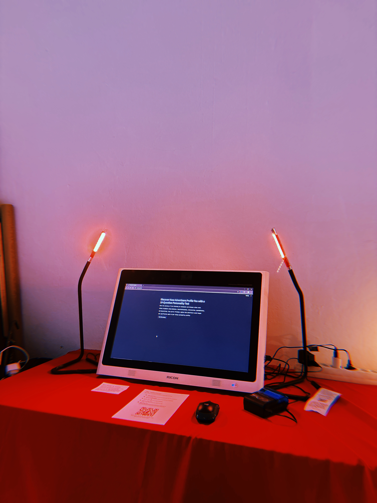

# Third Intervention: Do they really know?

## Reflection after research and exploration

{style: width="480", align=right}

After organizing MdeFest, I realized that many people are indeed unfamiliar with the concepts of data privacy and surveillance. I believe my goal of creating interactive tools to visualize and communicate surveillance and data collection in a non-private manner worked well. By making it interactive and somewhat fun, I think people engaged more with the concept than with deep reflection. The tool surprised many because of its simplicity yet sparked conversations. What generated the most impact, in my opinion, amidst the Aggressive machine, Read The Room, and The Ad Profiler—all detailed in my final paper written by Jorge Muñoz—was the ethical questions. Through interactive means, I prompted people to reflect on technology, surveillance, and privacy.

From this, I noticed contradictions in people's views. While many believe privacy is a universal right and that having nothing to hide doesn't negate privacy, some admitted they don't consider themselves important enough to care why so much of their data is collected. Opinions varied on whether privacy is dead and on technology's role today. Some absolve technology of blame for current issues, while others blame it for eroding our privacy.

Therefore, the MDEFest event I organized aimed to use interactive tools and informative posters to illustrate how much data individuals generate in a single day and how much information can be gathered about them. It aimed to make them reflect on how Meta and Facebook already collect vast amounts of data about them and whether what these platforms show us aligns with our desires or merely reflects what they think we'll like. It also aimed to provoke thoughts on free will: whether our actions are genuinely ours or simply taught to us.

**Reflecting back, while informative, the event lacked deeper reflections and actionable solutions. It was mainly about providing information. Personally, I hoped for more empowerment and action rather than mere reflection. Nonetheless, this topic remains crucial. As a designer, exploring it is challenging because my current role is mainly to educate others and ensure they understand. Moving forward, it's vital not only that people understand but also that I incorporate these concepts into my projects and acknowledge that technology, in my view, does impact society. Thus, I aim to create technology that respects our privacy.**