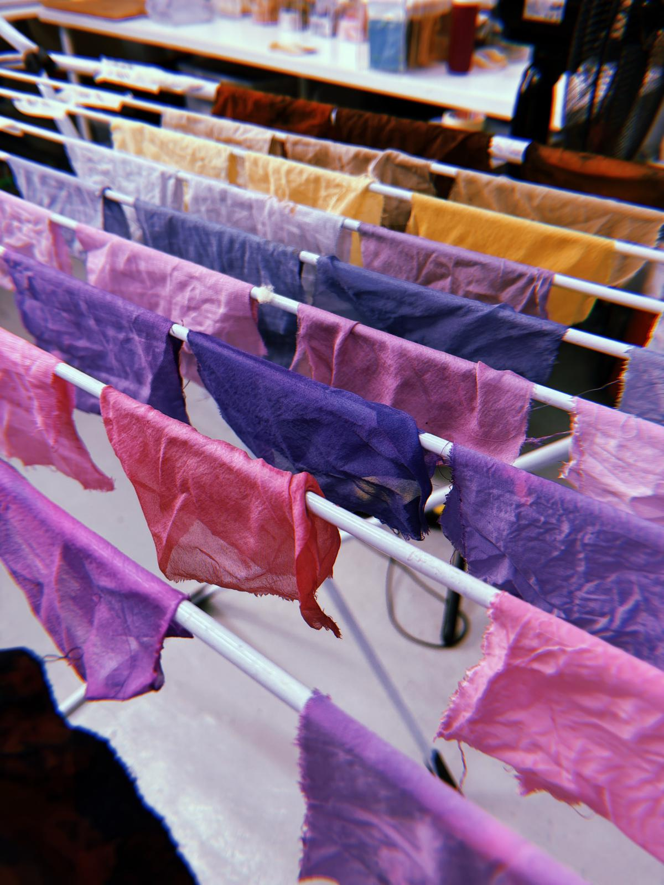

---
hide:
    - toc
---

# Biochromes

## Reflection
{style: width="480", align=left}
This course marked my first experience in the second year, and while it didn’t directly tie into my thesis, it was enlightening to explore how colors can be created from natural sources. The initial lecture provided insight into the process of making biocromes, highlighting various techniques for creating dyes from plant, insect, and even bacterial pigments.

Throughout the week, the class shifted into a workshop format where we learned to convert natural materials into inks. I chose to work with purple cabbage, and it was fascinating to witness how the vibrant lilac transformed into different shades of dye. This experience challenged my understanding of color creation and highlighted the complexities involved, particularly with producing green—something I had never considered before.

Even though the course was not directly related to my thesis, it provided valuable knowledge about sustainable practices in an industry notorious for its pollution. The class emphasized the importance of seeking environmentally friendly alternatives in textile dyeing, pushing us to think critically about the materials we use. Overall, it was a captivating journey, and I look forward to sharing the collective conclusions from our group as we collaborated to experiment with various natural colors.

## Deliverable
### Inspiration
{style: width="200", align=left}
In this course, when we were told we’d be working with dyes, I was really excited to try making a purple one. This excitement came from a memory of a Filipino classmate from last year who always used purple yam in everything. That material is called ube, a purple yam commonly used in many Filipino desserts. Despite not finding it visually appetizing at first, I became fascinated by the color itself because purple desserts are so rare, but in the Philippines, purple is used a LOT in food. So, when I heard about natural dyes, ube immediately came to mind. I thought it could be an amazing dye, not only because of its strong, vibrant color but also because it's a unique purple that you don't often see in other contexts.

My goal was to focus on creating a deep, vibrant purple color. In the end, I decided to experiment with cabbage, trying to experiment with a purple dye made from natural materials.

 [How to do purple dye with ube ](https://www.ijsrd.com/articles/IJSRDV7I30099.pdf).

### Materials and Tools
{style: width="200", align=left}

- Natural Dye Sources: Onion skins, red cabbage, avocado pits, turmeric, spinach, pomegranate, black beans, cochineal, eucalyptus leaves, indigo leaves.

- Fibers: Silk, cotton, viscose, linen.

- Mordants: Alum (brightens colors), iron (darkens colors).

- Modifiers: Lemon juice, vinegar, sodium bicarbonate.

- Equipment: Pots, measuring cups, spoons, silicone spatula, scale, bowls, containers, tape, marker.

  

### Process & Workflow
**1. Preparation of Fabrics:**

- Scouring: Clean plant-based fibers (cotton, viscose, linen) by simmering in water with 2% sodium carbonate for one hour to remove impurities and enhance dye absorption.

- Protein Fibers: Rinse silk under warm water with mild soap.

**2. Dye Extraction:**

- Chop natural dye sources into small pieces.
- Simmer in water for about an hour to extract pigments.
- Strain the mixture to separate the dye liquid from solid residues.

**3. Mordanting:**

- Weigh the fabric to determine the amount of mordant needed.
- For alum: Use 12% of the fabric's weight.
- For iron: Use 1% of the fabric's weight.
- Dissolve the mordant in water, add the fabric, and simmer for an hour.

**4. Dyeing:**

- Submerge mordanted fabrics in the dye bath.
- Simmer for an hour, then allow to soak overnight for deeper colors.
- Remove fabrics, rinse, and hang to dry.

**5. Color Modification:**

- Adjust pH to alter colors:
- Acidic modifiers (e.g., lemon juice) can shift colors towards pinks and reds.
- Alkaline modifiers (e.g., sodium bicarbonate) can shift colors towards greens and blues.

### Results and Observations
- Natural Color Base: Without any mordant, the dye produced a soft light purple (Pantone 667 C). 

- Impact of Iron Mordant: Introducing iron to the dye bath shifted the hue significantly, resulting in a deep, dark blue (Pantone 425 C). Iron acts as a color modifier by darkening the shades, illustrating the potential for creating a more muted and earthy palette.

- Effect of Alum Mordant: Using alum as a mordant enhanced the vibrancy, leading to a dark purple shade (Pantone 269 C). Alum brightens and deepens the color, making it a good choice for achieving rich, jewel-toned fabrics.

- Acidic Modifiers: The addition of lemon juice shifted the color towards a bright pink (Pantone 682 C). The acidic environment alters the pH, causing the anthocyanins to take on a warmer tone. 

- Alkaline Modifiers: Combining lemons with sodium carbonate produced a darker pink (Pantone 688 C). The slight increase in alkalinity pushed the color further into the pink spectrum.

- Combination with Vinegar and Alum: Adding vinegar alongside alum created a vibrant purple (Pantone 260 C). This mix amplifies the intensity of the color, suggesting that dual modifications can enhance the visual appeal of the dye.

The variations achieved through different mordants and pH adjustments reflect the sensitivity of plant-based dyes to chemical changes. This exploration highlights not only the beauty of working with natural pigments but also the importance of understanding the chemistry behind the colors. 

 [Link to the Miro Board of our Recipes](https://miro.com/app/board/uXjVPPdzF9s=/).

