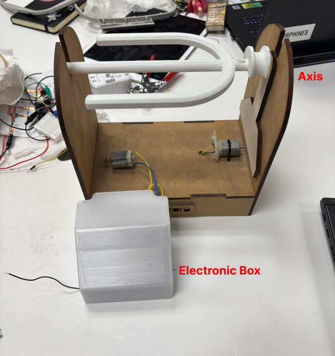

---
hide:
    - toc
---

# Open Source Hardware: From Fibers to Fabrics 

## Documentation: Spinning Motor

### Overview
This project was an exploration into creating a spinning motor with 3D-printed components. The designs we say as reference rely heavily on plywood and metal components for their structure and functionality. Our goal was to challenge this convention by integrating 3D-printed parts into the design, alongside laser-cut plywood.

**Goals**

- To explore the feasibility of using 3D-printed parts for a spinning motor.

- To experiment with design modifications that adapt existing models for 3D printing.

- To create a functional spinning motor prototype capable of handling wool and spinning it effectively.

**Project Outcome**

We were unable to create a fully functional clean prototype. The project works but needs design and material modifications to achieve functionality. The process has been a valuable learning experience, particularly in the challenges of tolerance, material properties, and system integration.

### References

### Bill of Materials
**Purchased Parts**

- PLA Filament: For 3D-printed parts.

- Plywood: 5mm sheets for laser cutting.

- Elastic Bands

- Glue

- Hooks M4x15mm

- DC Motor: Micromotor 130 1.5V-6V (and alternatives for testing).

- Electronics:

    - FQP30N06L MOSFET

    - Potentiometer (VOX 100KA V847A)

    - 1kΩ Resistor

    - 1N4001 Diode

    - 9V Batery

    - Battery converter

**Unique Parts**

- 3D-Printed Components

    - Spool

    - Axis

    - Electronics housing/box

    - Tensor Piece

- Laser-Cut Wooden Components

    - Structure base

    - Side supports

### Assembly Instructions
**Step 1: Prepare the Components**

1. Gather all 3D-printed and laser-cut parts.

2. Ensure the axis, spool, and hooks are free of defects (sand and adjust if necessary).

**Step 2: Assemble the Spool and Axis**

1. Insert the axis into the spool, ensuring a snug fit.

2. Add hooks to the spool manually to guide the wool.

**Step 3: Assemble the Structure**

1. Assemble the plywood pieces:the stable base and side supports.

2. Ensure the structure provides sufficient clearance for the rotating spool.

3. Attach Tensor Piece to the structure and add tensor string or elastic bands.

**Step 4: Electronic System**

1. Assemble the circuit with the resistor, potentiometer, diode, and MOSFET.

2. Mount the motor to the structure securely

3. Connect the motor shaft to the axis directy via a string or elastic bands

4. Secure electronics inside the housing and attach to the structure

**Step 5: Test the System**

1. Power the motor and adjust the potentiometer for speed control.

2. Observe the rotation of the spool and axis, addressing any misalignments or issues.

### Source Files & Export Files
**Source & Export Files**
We took [this project](https://www.thingiverse.com/thing:1120037)  as a reference and modified it to fit our 3d printer (made it 30% smaller) and make the structure with plywood. LEARNINGS: It takes more time to adapt somebody else's designs than to actually do your own.

 [You can find our edited files here ](https://drive.google.com/drive/folders/1KpQKZK0iS5Lh3WIeDWW7AQKxq7nkK3YE?usp=sharing).

### Software
- *CAD Software*:
    - Rhino or Blender for design modifications.
- *Slicing Software*:
    - PrusaSlicer and Bambu Studio for 3D printing.

### Review and Rebuild
**What Happened**
This project was an experimental attempt to innovate on traditional spinning motor designs. The key innovation was the use of 3D-printed parts in place of the usual plywood and metal components. However, the following issues were encountered:

1. *Tolerance Problems*: Original designs lacked sufficient clearance for real-world assembly.
2. *Material Limitations*: PLA’s heat resistance was insufficient for prolonged motor operation.
3. *Structural Instability*: The wooden structure and motor fixation required significant manual reinforcement.
4. *Speed Control Challenges*: Early motor choices were unsuitable, and tensioning systems needed refinement.

**Future Improvements**
1. Redesign the spool and axis to incorporate locking mechanisms and better tolerances like make a 13 mm diameter instead of 12 on the axis. (See more of what to change and our exploration in the progress part)
2. Use heat-resistant materials like PETG or ABS for 3D-printed parts.
3. Create a stable, modular structure with integrated motor mounts and electronics housing.
4. Test the system more thoroughly under real operating conditions to identify additional weaknesses.

### Exploration and Progress (Day 1–4)

**Day 1: Initial Prototyping**

1. *Electronics Setup*:

    - Began assembling a basic circuit with a resistor, potentiometer, and a DC motor.

    - Tested the motor's functionality with the circuit; initial results showed it was operational but lacked speed control.

2. *3D Printing*:

    - Started printing parts for the spool and axis. We printed the spool horitzontal to make the layering more resistant. That ment reducing its size by 30% to make it fit our printer.

    - Encountered initial printing errors but used failed prints to test the system. 

    - We took out the hooks from the the axis file so we could later add a better ones manually.

3. *Challenges*:

    - Observed that the spool and axis lacked tolerance for proper fitting and movement. 

**Day 2: Refinement and Testing**

1. *Soldering and Circuit Finalization*:

     - Completed soldering the electronics and tested the motor with the spool.

    - Discovered the motor was too fast, causing stability issues.

    - Switched to a 6V motor, which provided better speed control and flexibility.

2. *Mechanical Adjustments*:

    - Modified the spool diameter (originally 14mm) to 12mm for better fitment with the axis.

    - Tested different materials and connections, noting that the spool spun too loosely.

3. *Challenges*:

    - Printing errors continued, particularly with the axis, due to the design's lack of tolerance.

    - Identified that the axis needed further modifications to prevent slippage and improve functionality. (We kept it that way and added resistant tape to make it more steady)

**Day 3: System Integration**

1. *Assembly*:

   - Connected the motor to the axis, with the spool tension controlled via a string mechanism.

    - Observed that the spool and axis could rotate in different speeds due to the tension mechanism (intended)

2. *Structural Testing*:

    - Used a previous year's plywood structure to test the system instead of creating a new one.

    - Laser Cut a structure.

3. *Challenges*:

    - The motor was mounted temporarily on a wooden piece but required proper fixation.

    - The structure lacked steadiness, leading to misalignment during testing.

**Day 4: Final Adjustments and Observations**

1. *Design & Modifications*:

    - Created a electronics housing using 3D printing.

    - Reinforced the wooden structure manually to improve stability.

2. *Testing Results*:

    -The system worked partially, with the axis and spool spinning, but the design had significant flaws: 1. The spool moved too freely on the axis, requiring temporary fixes (rubber bands and tape).2. Friction and alignment issues made it inconsistent.

3. *Reflections*:

    - The design of the axis and spool requires further refinement, particularly to introduce a locking system and adjust tolerances.

    - The use of PLA for 3D printing raised concerns about heat resistance during prolonged motor operation. 

    - There is a need to build a better structure.

### Licence
This project is released under the **MIT License**, allowing users to use, modify, distribute, and share the project freely, as long as proper attribution is provided.

## Reflection