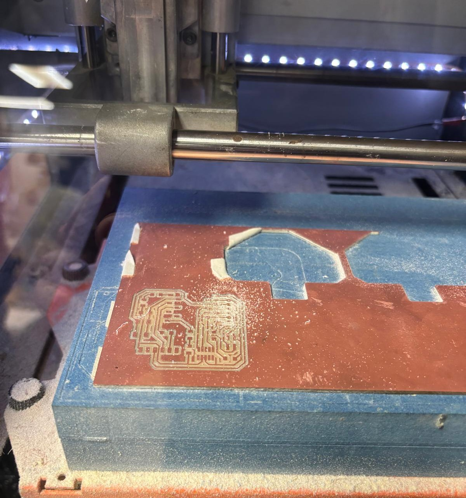
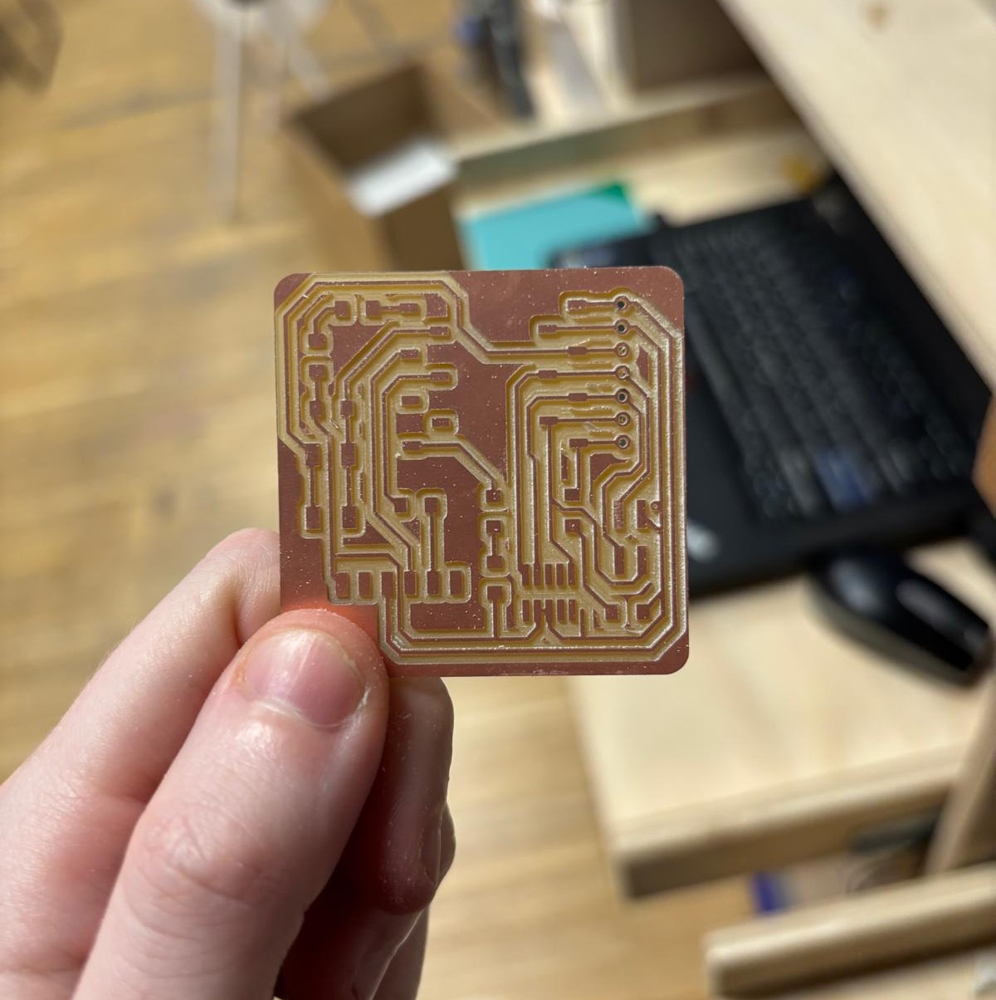
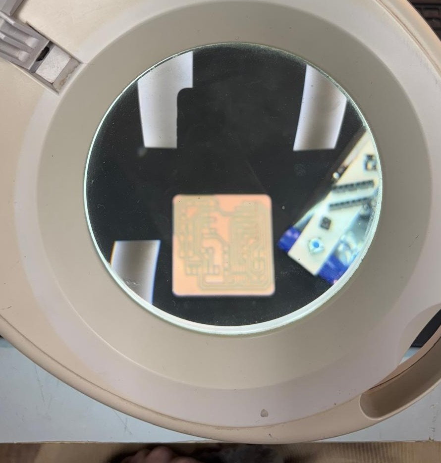
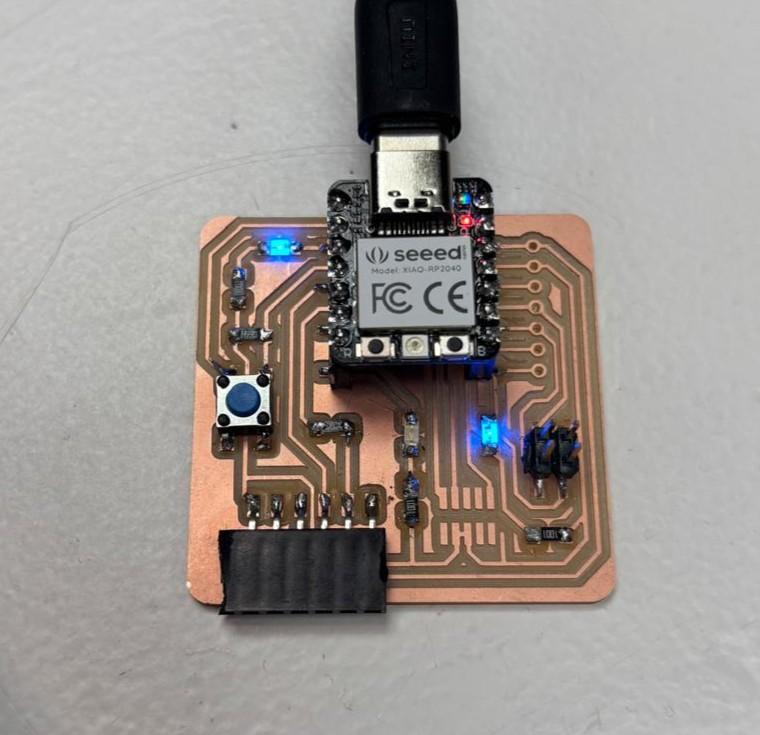

---
hide:
    - toc
---

# Electronics Production

### Overview  
In this assignment, we were given a pre-designed electronics board that supports an ESP32 (specifically, the XIAO 4020 model). Our task was to fabricate the board using a CNC milling machine, solder the components, and test its functionality.  

This process involved:  
- CNC milling to cut the PCB  
- Soldering small components  
- Testing the microcontroller and debugging any issues  

---

### Materials & Components  
| **Component**                                   | **Quantity** |
|------------------------------------------------|-------------|
| SEEED STUDIO XIAO RP2040                       | 1           |
| CONN HEADER SMD R/A 6POS 2.54MM                | 1           |
| Tactile Switch SPST-NO Top Actuated Surface Mount | 1           |
| LED BLUE CLEAR 1206 SMD                        | 3           |
| RES 1K OHM 1% 1/4W 1206                        | 4           |
| RES 499 OHM 1% 1/4W 1206                       | 1           |
| CONN HDR 7POS 0.1 TIN SMD                      | 2           |

### Tools Used 
- CNC milling machine  
- Soldering iron  
- Soldering wire & flux  
- Tweezers (for precise placement)  
- Multimeter (for testing connections)  

---

### Step-by-Step Process

**1.Preparing the PCB Design Files**
  
To begin, we needed to generate the correct files for CNC milling and soldering.  

We followed a series of steps to prepare our PCB for fabrication. First, we downloaded the pre-designed PCB layout provided by the instructor. Next, we opened the design in ModsProject.org to generate the necessary cutting files, using the SRM-20 MILL 2D PCB machine. For this process, we set the cut depth for the outline to 0.15 mm and defined the origin of the mill as 10.10.10 mm. Finally, we exported all the required files for milling and soldering, including traces in .png or .svg format for the milling process, an outline in .png or .svg format to define the board’s shape, and drill files in .drl format if needed.

**2. CNC Milling the PCB**

The next step was to cut the PCB using a CNC milling machine. The design was already provided, so our main task was to load the file, set up the material, and run the machine.  

- The milling process was quick and satisfying to watch.  
- Since I had prior experience with CNC cutting, it was straightforward.  
- The key challenge was understanding how the design was structured, which wasn’t covered in the course.  

|  |  |
|:--:|:--:|

 

**3. Soldering the Components**  

{style: width="380", align=left}

Once the PCB was milled, the next step was soldering.  

- The components were **very small**, making soldering tricky.  
- It took about 1–2 hours to complete.  
- I mistakenly soldered an LED incorrectly and damaged the copper pad while trying to fix it.  
- This led to **one LED not working**, but since the microcontroller functioned, I decided not to fix it due to time constraints.  

> **💡 Lesson Learned:** Patience is key when soldering. Rushing can lead to mistakes that are difficult to undo.  

 
---

**4. Testing the Board**
{style: width="380", align=left}
After soldering, we tested the microcontroller and LEDs.  

- The **ESP32 Tau 4020** worked fine.  
- One LED didn’t work due to a soldering mistake.  
- The code was simple and functioned as expected.  

> **💡 Lesson Learned:** Proper testing ensures everything works before finalizing the project.  

---
  
  

## Challenges & Learnings  

### **Challenges Faced**  
1. **Reading the PCB design** – I got confused and made a soldering mistake.  
2. **Small components** – Precision was needed, and I struggled with some placements.  
3. **Damaging the copper pad** – Removing incorrectly soldered components can be risky.  

### **Key Learnings**  
- I need to **improve my soldering skills** to avoid similar mistakes in the future.  
- Learning **PCB design from scratch** would help in understanding the structure of such projects.  

---

## **Future Improvements**  
- Spend more time practicing fine soldering.  
- Learn how to design a PCB from an idea to an actual circuit.  
- Experiment with different soldering techniques, like **using paste instead of wire solder**.  

---

## **Conclusion**  
This was a great experience that reinforced my knowledge of CNC milling and soldering. While the process itself was simple, the **real challenge was precision in soldering**. Moving forward, I plan to explore **PCB design and different soldering methods** to improve my skills.  

---

🔗 **Reference Repository:** [GitLab Repo](https://fablabbcn-projects.gitlab.io/learning/educational-docs/fabacademy/classes/08-ElectronicsProduction/)

