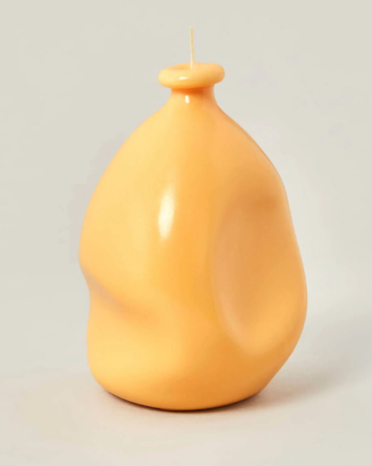
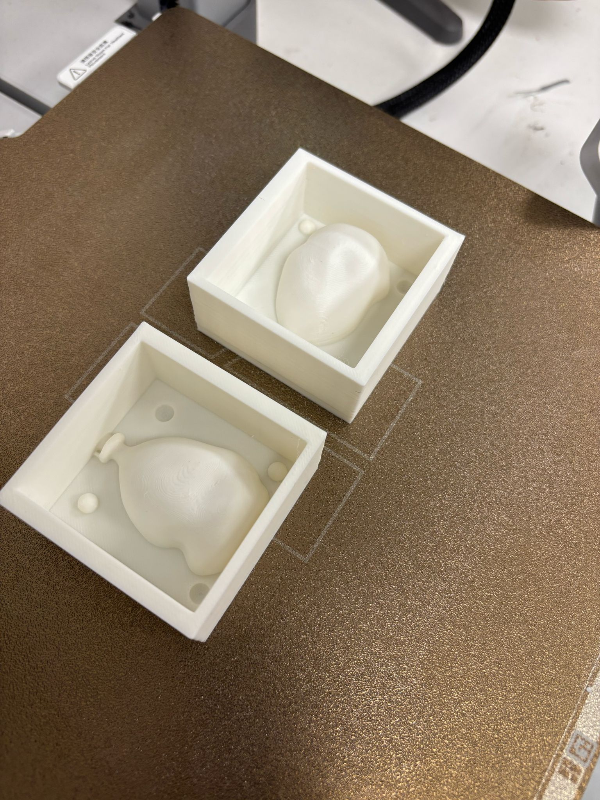
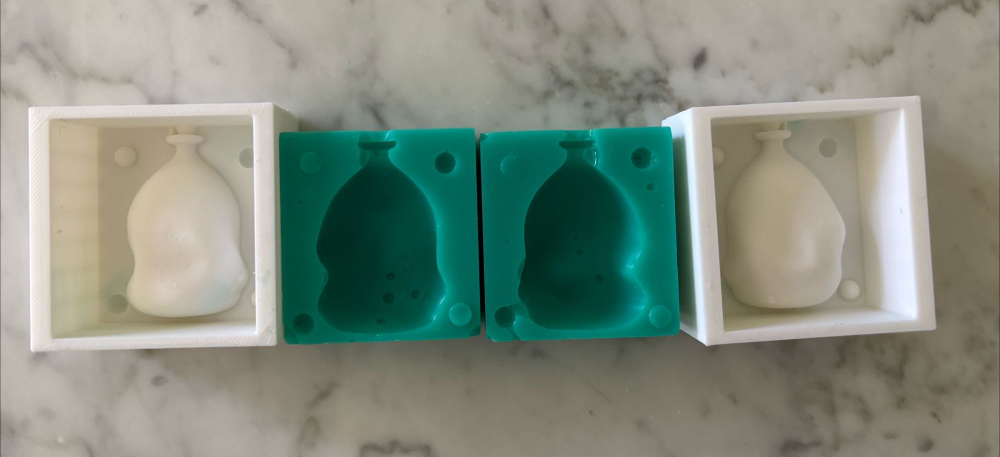

---
hide:
    - toc

---

# Molding and Casting

### Idea Development
{style: width="400", align=right}

I started this week without a very clear idea of what I wanted to create. I initially thought of making a candle—something with an unusual, organic shape. The concept that came to mind was a deflated balloon. I figured this could make for a fun candle, and it would also allow me to explore two-part mold making. The plan was to design a two-sided mold that would fit together, so I could pour in wax and create a hollow object.

### Materials and Tools Used
**Materials:**

- PLA filament (for 3D printing the mold negatives)

- Food-safe silicone (for casting the mold)

- Melted chocolate (for final casting)

- Water (used unintentionally during cleaning and caused defects)

**Tools and Equipment:**

- 3D printer (home setup, FDM type)

- Silicone mixing containers and stirrers

- Microwave (for chocolate melting)

{style: width="400", align=right}

### Design Process

I modeled the deflated balloon in 3D and built a negative mold with two halves that could align and connect. I added features like a pouring channel and a vent hole, imagining how the wax would fill the shape.

However, midway through the design phase, I decided to scale down the model without considering how that would impact the functional parts of the mold. That turned out to be a key mistake. Once I printed the mold and poured the silicone, I realized the walls were too thin, the connecting elements were too small to be effective, and the vent merged with the pouring hole. Everything lost its structural integrity because of the scaling.

### Manufacturing Challenges

Because I was sick that week and couldn’t go to the lab, I decided to work from home using what I had: a 3D printer, food-safe silicone, and basic materials. I printed the mold at home and cleaned it with water—but didn't dry it properly. When I poured the silicone, the remaining water droplets left marks inside, creating unwanted impressions.

The silicone I used takes 10 hours to cure and is designed for food use, so instead of wax, I had an idea—why not cast chocolate instead?
  
{style: width="690"}

### First Casting Attempt: Chocolate Balloon
Switching to chocolate introduced a whole new set of problems. Chocolate isn’t very fluid when melted, and pouring it into a small two-part mold was extremely slow and difficult. I couldn’t see how much chocolate was inside, and because of the shape and the tight interior, the chocolate didn’t fill the mold properly. The cast was uneven and fragile, and overall, the process was frustrating and impractical.

{style: width="690"}

### Reflection and Redesign
**Key lessons learned from the first prototype:**

- Do not scale down designs without considering the impact on wall thickness, connectors, and functional features.

- Avoid working blindly with viscous materials like chocolate in closed molds(you need visibility and flow control).

- Moisture inside the mold (from water cleaning) can leave defects in the silicone.

- Working outside the lab significantly limits access to essential tools and quality control.

- A two-sided mold is not ideal for chocolate casting due to visibility and pouring challenges.

**Redesign decisions:**

- Switch to a single-sided mold with a wide open surface for easier pouring and drying.

- Choose a new shape that supports both aesthetics and function.

- Plan to embed ingredients like almonds or other chocolates inside the mold for added texture and flavor.

- Design with food casting in mind from the start—prioritize usability over complexity.

### Second Mold