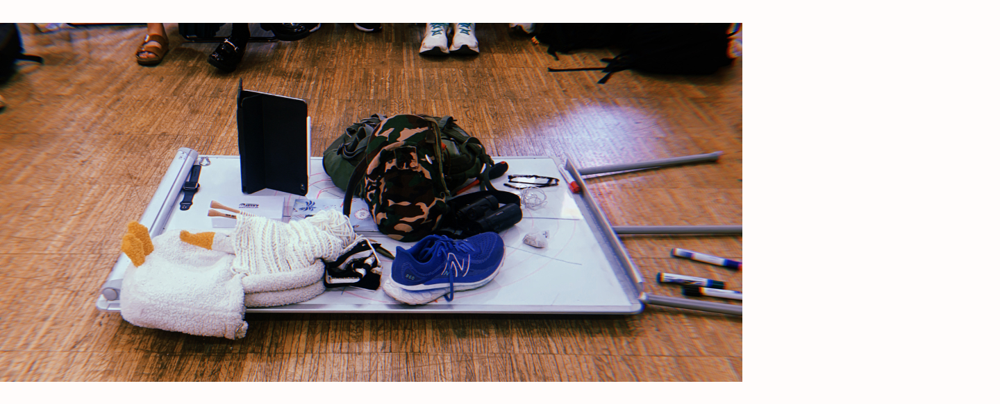
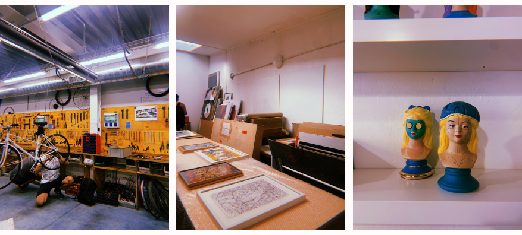
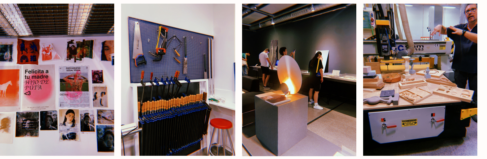

---
hide:
    - toc
---

# Landing
### Reflection
{align=right}
As I step into this new phase of my education and career journey, I can't help but feel excited about the fresh changes and opportunities ahead. Every day, I'm gaining a lot of new knowledge, which reminds me why I decided to pursue this master's degree in the first place. Meeting fellow students and educators this week has been truly inspiring, and I believe we're all set for an enriching journey where we'll learn and grow together as a class and comunity.

Yet, amidst this external adventure, I'm also dealing with a personal challenge. I've come to realize that if I want to make a positive impact on the world, I first need to confront my own biases, habits, and thoughts that have been shaped by society and my upbringing. My biggest struggle right now is with myself. I aspire to open my mind to new information and fresh ways of thinking and creating, but I must overcome self-doubt as a starting point. This week, we've delved into the concept of transhackfeminism, decolonizing technologies and also talked about the fact designers should draw from personal experiences to design for the future. However, my mind is still filled with questions like: Am I capable enough for this master's program? Can I actively contribute to class discussions and add value to our group? Will I be able to grasp everything they're teaching us? 
Nevertheless, every day in class, I learn new things from my classmates, and it's evident that all of us share some level of insecurity regarding the master's program. While we're enthusiastic about the journey, we're still figuring out how to contribute our knowledge effectively.

To sum it up, this week has taught me that my journey won't be a perfect, straightforward path; there will be plenty of mistakes along the way as I learn and grow. I'm actively working on becoming more open-minded, creative, and adept at expressing my ideas clearly while exploring various subjects. My primary goal remains making a positive impact, and although I have a general direction in mind, I'm open to discovering new interests and possibilities along the way.

## Day to day
### The objects that defines us
On the first day of class we talked about the objects that are connected to your identity, history, background, wishes, desires, or interests. This exercise helped me get to know my classmates better and learn about their backgrounds and experiences. It also made me realize how objects can have various meanings for us. As a product designer, I aspire to create something in the future that is so essential and personal that it becomes a part of who you are and reflects your identity and desires. It is funny how a shoe or a simple watch can be part of your background and history and can mean something more than just the purpose it was made for.

### Discovering a new Barcelona: The secret of Poblenou
Being from Barcelona, it was really exciting to explore new places I've never been before. I'm really looking forward to seeing a different side of Barcelona through the perspective of Iaac and my classmates.

### Elisava
Visiting Elisava was a really exciting experience for me. Throughout my academic journey, I had considered studying there for both my bachelor's and master's degrees. However, I always felt that my technical background might not align with the design focus of the school.

Elisava boasts impressive facilities and a wealth of laboratories that encourage curiosity and learning. In my opinion, I've made the right choice by pursuing this master's program at Iaac. It's evident that Elisava has a large student body with numerous classes and seminars, which means you may feel like just another student in the daily routine. In contrast, at IAAC, you become part of a close-knit community, offering you the freedom to design without constraints.

Choosing this master's program offers the best of both worlds. You can enjoy the privilege of utilizing Elisava's labs while also benefiting from the freedom that IAAC provides, allowing you to use the Fab Lab for your individual projects.

