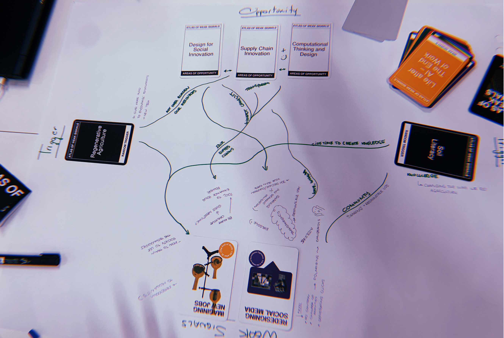
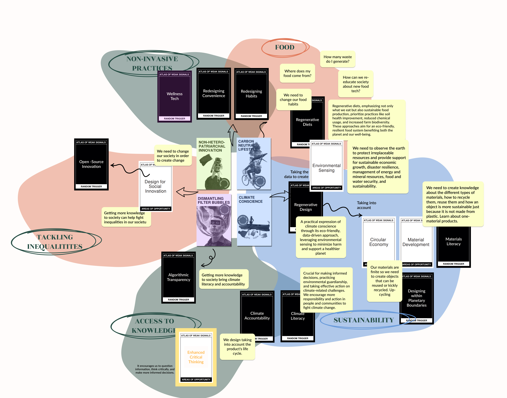
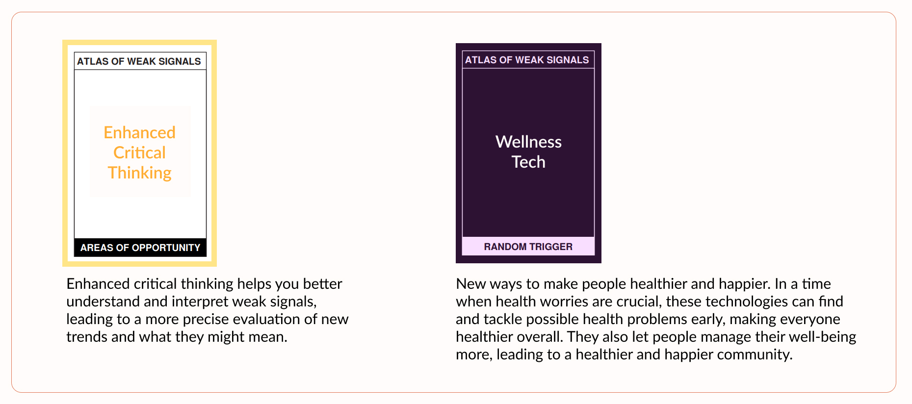
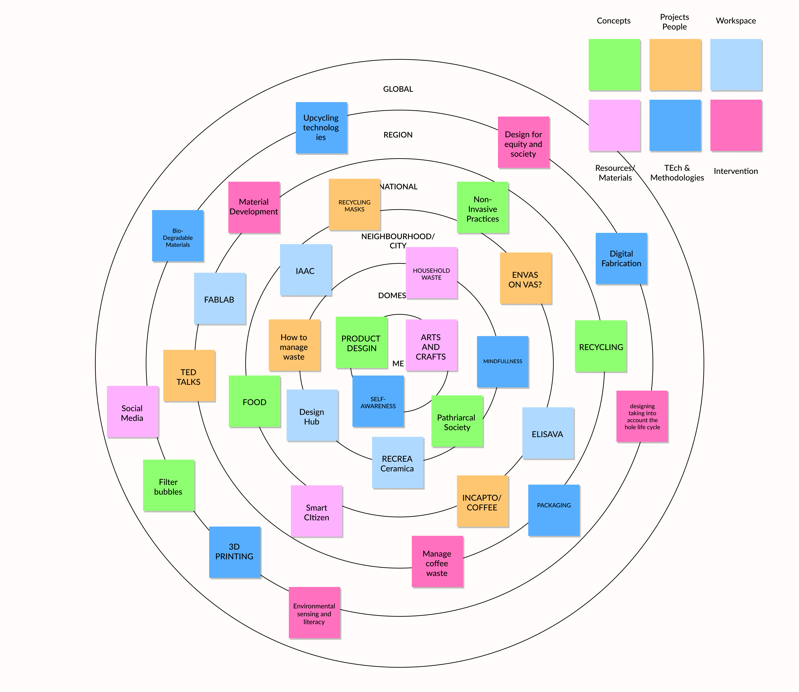

---
hide:
    - toc
---

# Atlas of Weak Signals

### Introduction
{style: width="420", align=right}
At the beginning of the week I didn’t know what to expect from this course nor did I know what “weak signals” were. After navigating through different topics, playing with our Atlas of Weak Signals card game and debating with our classmates, I started to understand the concept and purpose of this seminar. The main focus of this class was for us to understand that designing for emergent futures can be difficult since we do not know what the future might be, and that in order for us to design we need to sit with ourselves and determine every fragile indicator within our lives that has the potential in changing the future.

### First deliverable
During the course of the week we were told to explore the cards and pick the ones that relate more to us. We were little by little creating our own Design Space in which we mirrored our lives, passions, thoughts and old projects. With that in mind, we were designing a clear image of what proactive strategies we could do to support our interests and contribute positively to society to create and adapt to change.
In my case, coming from a background in product design engineering and growing up as a 23-year-old woman in a society influenced by technology, media, and a patriarchal family, I've developed various interests that drive me to seek change in our current societal norms. The weak signals that have caught my interest are: 

2.jpg)

### My Final Design Space

### Reflection
I am aware that I have multiple goals, most of which I haven't yet put into practice as a designer. These mainly reflect the challenges I encounter in my personal life on a daily basis. Nevertheless, I am increasingly determined to discover solutions and new methodologies that align with the future I envisage in my Design Space. For me, it's about delving deeper into comprehension and awareness. Understanding more enables us to shape our future, and acknowledging problems is the first step in overcoming them. I aspire to begin addressing these issues at a local level and subsequently expand my efforts to other communities. My aim is to create something that promotes sustainable diets, products with shorter life cycles, and societal changes that foster a community with direct access to knowledge and equal opportunities.

### My First Atlas of Weak Signals

### My Card Additions

### Multiscalar Design Space

