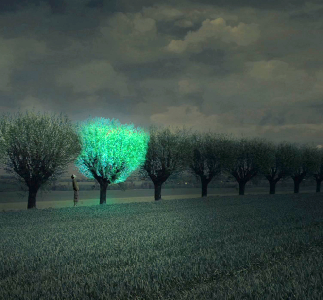

---
hide:
    - toc
---

# Biology Zero

## My GMO: Glowing trees
{style: width="470", align=right}
The proposed genetically modified organism (GMO) involves the creation of bioluminescent trees, specifically Quercus ilex, to illuminate paths outside of cities where conventional electricity and streetlights are impractical. This innovation aims to provide natural and sustainable lighting for areas like village roads, hiking trails, and small zones requiring visibility without the need for external power sources.

To create this GMO, the focus is on introducing bioluminescent traits found in organisms like fireflies into Quercus ilex. The chemical reaction responsible for bioluminescence involves luciferin and either luciferase or photoprotein. While fireflies naturally exhibit this trait, the goal is to transfer the genes associated with luciferase enzyme production and luciferin binding into Quercus ilex.

**The process involves genomic analysis of fireflies to identify key genes, including luciferase (Luc1) and luciferin-binding proteins.** Genetic modification would then integrate the firefly luciferase gene into Quercus ilex plant cells. The challenge lies in enabling the plant to produce luciferin independently without relying on external chemical fuel for sustained bioluminescence.
While genetically modifying the tree to synthesize luciferin is a potential solution, there are also alternative approaches that involve exploring how the plant might absorb luciferin, possibly through watering with a firefly compound. However, this method introduces the need for an external chemical fuel, which contradicts the objective of creating self-sustaining, off-grid lighting solutions.

**Creating bioluminescent Quercus ilex trees is theoretically achievable through genetic modification, borrowing traits from fireflies. The challenge lies in developing a self-sustaining system where the trees generate light without external chemical inputs. While obstacles exist it can solve the need of environmentally friendly lighting for remote areas.  However, before putting this idea into action, we need to think about how it might affect nature, follow rules and regulations, and improve the technology more. While the idea is good, we need to be careful and think about the challenges and ethical issues before making it happen in real life.**

### References
>National Geographic Education. (n.d.). Bioluminescence. National Geographic Society. https://education.nationalgeographic.org/resource/bioluminescence/

>Harvard University, Science in the News. (2015). How to Make a GMO. https://sitn.hms.harvard.edu/flash/2015/how-to-make-a-gmo/

>Firefly Bioluminescence: From Chemistry to Biotechnology. Ed. Viviani, V.R. World Scientific Publishing, 2019.

>Engineered Glow. (n.d.). Earth Island Journal. https://www.earthisland.org/journal/index.php/magazine/entry/engineered-glowing-plants-nanotech-environment/#:~:text=The%20team%20modified%20the%20firefly,chemical%20fuel%20for%20light%20production.

## Week 1 Reflection
{style: width="470", align=right}
This seminar has been a fulfilling experience for me, despite not having a prior passion for biology. Delving into the fundamentals of biology and exploring topics aligned with my interests, particularly in sustainability, has been enlightening. While the seminar leaned towards theory rather than practical applications, the wealth of information received justified the approach. I discovered intriguing facets of biology, from cultivating spirulina to comprehending the intricacies of how a body works. The discussion around CRISPR-Cas caught my interest, and it's surprising that it's not a more commonly discussed topic.

Additionally, the seminar addressed the profound impact of climate change on various aspects of our lives, from online searches to dietary habits, revealing prevalent misinformation. This realization has sparked my passion and inspiration. While we often talk about futuristic discoveries, the truth is that the future is now, and innovations are already underway. Scientists have devised solutions to pressing issues, with the primary challenge lying in societal awareness. This seminar has been instrumental in helping me understand this crucial point.

**What stood out to me beyond the technical aspects was a profound reflection on how we can assist scientists in effectively communicating their knowledge to today's society. Nuria's emphasis on questioning information is timely, considering the diminishing engagement with scientific literature and renowned figures in the age of platforms like TikTok. Her contemplation on bridging this communication gap between scientists and the wider public is both insightful and thought-provoking.**

