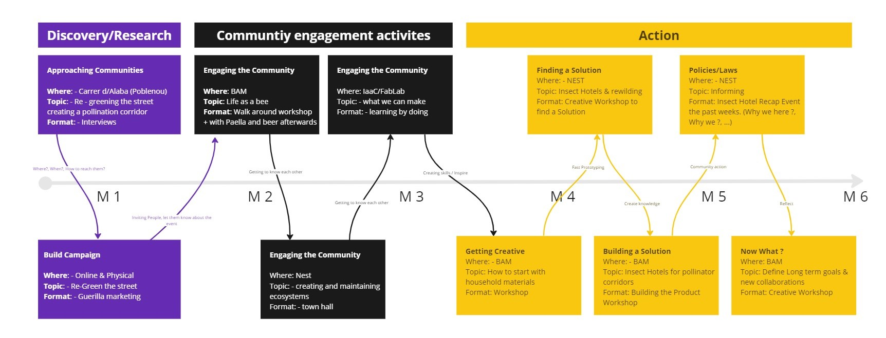

---
hide:
    - toc
---

# Design with Others

## Contents
### Soil
{style: width="470", align=right}
On the first day of this seminar, we were introduced to the general concept of soil and land. Additionally, we began to theorize about designing in complex and entangled contexts. Designing for a community, even a small one, has ripple effects on a larger scale and has a long-term impact. "Every challenge assessed with sufficient perspective, becomes a wicked one." During the initial seminar day, we explored the Sants neighborhood, identifying aspects that could pose conflicts regarding the soil.
As we strolled through the streets, it became apparent that soil, encompassing land and ecologies beyond human communities, was scarce in the Sants neighborhood. Essentially, everything we encountered and observed was tailored for humans. This led us to reflect on the fact that, if you were something other than human, like an insect for example, the terrain resembled a desert and posed significant challenges. We pondered on the diverse textures of the soil, noting that it was poorly maintained with litter strewn about.
This prompted us to contemplate why the soil was neglected, why there was so much trash, and why the local society seemed content with maintaining this state. We delved into the repercussions on non-human species and explored ways to transform this neighborhood into a hub of biodiversity, not just for humans.

### Land
{style: width="470", align=left}
Our visit to La Borda on the second day left a lasting impact. As the first cooperative housing in Spain built on land granted for use, it was a revelation, especially for someone like me who is from Barcelona and was previously unaware of La Borda. This experience led me to contemplate the nuances of designing for communities and the imperative of sustaining projects. It goes beyond merely contributing to a community; it involves understanding how to perpetuate the underlying philosophy and design principles over time. The visit also shed light on the integral role of politics in design and the often-overlooked possibilities within our reach.
Additionally, we delved back into the socio-ethnic aspects discussed on the first day of class, with a focus on the "land" component—everything from homes to creative spaces. This aspect offered me a fresh perspective on designing for others, even within our own human context. More than a technical learning experience for the master's program, it allowed me to explore different facets of Barcelona. It made me realize that, despite being a resident of this city, there is still much to learn, especially from these marvelous projects. They are already catalyzing positive societal changes, changes that deserve more attention and discussion.
### Visits
{style: width="470", align=right}
From the recent visits, two main things have stuck with me. Firstly, we've been given a lot of resources over these weeks to continue designing beyond IAAC. It's been really helpful to have access to places like the Ateneu de Fabricació and manufacturing spaces, providing alternative resources if I want to keep using this machinery after the master's program ends. Secondly, there's the consideration of life after the master's. While the master's program is great for reflection and bringing about change from a unique designer's perspective, there's the lingering question of how these ideas apply in the professional world. How do we bring about change, earn a living, have a life, and still maintain these perspectives? Getting to know my master's community and potential future connections has given me a clearer vision of what might come after the master's. These are additional tools that can also be used in connection with this week's seminar on designing for others, entering designer communities, and bringing about change.

## Intervention
Lorem ipsum dolor sit amet, consectetur adipiscing elit, sed do eiusmod tempor incididunt ut labore et dolore magna aliqua. Ligula ullamcorper malesuada proin libero nunc consequat interdum varius. Dignissim convallis aenean et tortor at risus viverra adipiscing. Urna nunc id cursus metus aliquam eleifend mi in nulla. Fermentum leo vel orci porta. Egestas diam in arcu cursus euismod quis viverra nibh. Consectetur adipiscing elit pellentesque habitant morbi tristique senectus. Aenean sed adipiscing diam donec adipiscing tristique. Non pulvinar neque laoreet suspendisse interdum consectetur libero id faucibus. Neque gravida in fermentum et sollicitudin ac orci. Adipiscing commodo elit at imperdiet dui. Mauris rhoncus aenean vel elit scelerisque mauris pellentesque. Urna et pharetra pharetra massa massa. Viverra maecenas accumsan lacus vel facilisis volutpat est. At urna condimentum mattis pellentesque id. Laoreet sit amet cursus sit amet. Quam pellentesque nec nam aliquam sem et tortor. Diam ut venenatis tellus in metus vulputate eu scelerisque. Pellentesque elit eget gravida cum sociis natoque penatibus et. Mi sit amet mauris commodo quis imperdiet massa tincidunt.

Lorem ipsum dolor sit amet, consectetur adipiscing elit, sed do eiusmod tempor incididunt ut labore et dolore magna aliqua. Ligula ullamcorper malesuada proin libero nunc consequat interdum varius. 

Lorem ipsum dolor sit amet, consectetur adipiscing elit, sed do eiusmod tempor incididunt ut labore et dolore magna aliqua. Ligula ullamcorper malesuada proin libero nunc consequat interdum varius. 

<iframe width="560" height="315" src="https://www.youtube.com/embed/FUPg-zJ5T0o?si=v6dAvZ2yJp_QVsKd" title="YouTube video player" frameborder="0" allow="accelerometer; autoplay; clipboard-write; encrypted-media; gyroscope; picture-in-picture; web-share" allowfullscreen></iframe>

More info in Miro Board:

<iframe width="768" height="432" src="https://miro.com/app/live-embed/uXjVNL6M8pY=/?moveToViewport=5068,-6378,22759,10475&embedId=481270919197" frameborder="0" scrolling="no" allow="fullscreen; clipboard-read; clipboard-write" allowfullscreen></iframe>

## Reflection
Lorem ipsum dolor sit amet, consectetur adipiscing elit, sed do eiusmod tempor incididunt ut labore et dolore magna aliqua. Ligula ullamcorper malesuada proin libero nunc consequat interdum varius. Dignissim convallis aenean et tortor at risus viverra adipiscing. Urna nunc id cursus metus aliquam eleifend mi in nulla. Fermentum leo vel orci porta. Egestas diam in arcu cursus euismod quis viverra nibh. Consectetur adipiscing elit pellentesque habitant morbi tristique senectus. Aenean sed adipiscing diam donec adipiscing tristique. Non pulvinar neque laoreet suspendisse interdum consectetur libero id faucibus. Neque gravida in fermentum et sollicitudin ac orci. Adipiscing commodo elit at imperdiet dui. Mauris rhoncus aenean vel elit scelerisque mauris pellentesque. Urna et pharetra pharetra massa massa. Viverra maecenas accumsan lacus vel facilisis volutpat est. At urna condimentum mattis pellentesque id. Laoreet sit amet cursus sit amet. Quam pellentesque nec nam aliquam sem et tortor. Diam ut venenatis tellus in metus vulputate eu scelerisque. Pellentesque elit eget gravida cum sociis natoque penatibus et. Mi sit amet mauris commodo quis imperdiet massa tincidunt.

