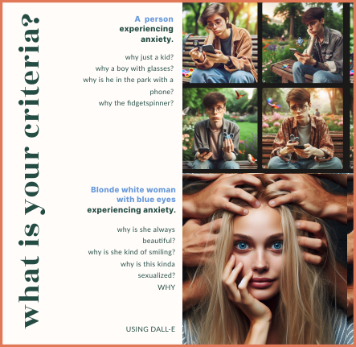

---
hide:
    - toc
---

# Extended Intelligences

## Reflection
{align=right}

From this seminar, I've gained valuable insights, especially since I've always been intrigued by artificial intelligence. Now, I have a better understanding of how it functions and how to generate it. I use AI daily, like ChatGPT, and view it not as a one-size-fits-all solution but as a tool enhancing creativity and task efficiency. Learning about its workings and underlying principles has been beneficial. I intend to incorporate this tool into my future endeavors, particularly in relation to mental health topics during my master's program.

Moreover, what intrigued me in this seminar is that we didn't only delve into the theoretical aspects but also touched on the ethical dimensions of AI. It plays a significant role in ethics and sociology, which I would like to explore further. **Post-seminar, my plan is to continue utilizing AI in my daily life while delving into its ethical boundaries. For instance, understanding how AI can assist in mental health, a highly personal area demanding subjective and emotional reactions. Exploring the ethical limits of these intelligences is also on my agenda.**

The most captivating aspect is that artificial intelligence is entirely shaped by the information it's fed. If you're a white man, you may inadvertently generate a racially and sexist biased AI. Technology is advancing rapidly, and these tools might be employed in jobs that people are reluctant to do but are crucial to our lives. For example, using AI to review resumes or make visa decisions based on images. Despite being mere robots, these intelligences contribute to a new form of violence and discrimination. It's crucial to recognize that behind these tools are people shaping them, potentially fostering societal biases. Therefore, my primary interest lies in continuing to explore this field, understanding its limits and the extent to which existing tools can be effective.**I'm less interested in creating AI from scratch and more focused on analyzing existing tools, acknowledging their limits, and emphasizing the necessity of ongoing human supervision and comprehension.**

## Deliverables

### Individual
**Dataset:**  [Student Mental health.](https://www.kaggle.com/datasets/shariful07/student-mental-health)
I chose this dataset because, fundamentally, I have always been interested in mental health and the field of artificial intelligence. I believe I would like to connect the two to assist people with mental health issues. The challenge is that, for me, mental health is a highly subjective matter, and using a dataset about something so specific seems peculiar, strange, and difficult to understand. This dataset simply correlates the academic situation of individuals experiencing anxiety, depression, or post-traumatic stress. Although it seems like a dataset that currently cannot be used, it may contribute in the future to some form of artificial intelligence that can generically help people with mental health problems.

### Group

For our group project, we formed a team randomly and then sought to identify a shared interest. It turned out that most of us were passionate about plants. Personally, I was intrigued by the challenge of keeping them alive because I struggle with cultivating, watering, and caring for them properly. We thought it would be a worthwhile endeavor to create an artificial intelligence that assists in plant care. While we acknowledge that such technology likely already exists or is in development, the unique aspect here was the abundance of available information. Unlike subjective tasks, such as creating an AI to detect emotions, our goal was to focus on something more objective—making plant care accessible and beneficial for everyone. This is why, when considering ethical concerns, we found fewer obstacles compared to scenarios that might involve creating other types of artificial intelligence.

If you want to see more of our project, look at this [Report](https://docs.google.com/document/d/e/2PACX-1vS8Vcf91u5kejEWhRysW3KiSPFA865BY4-CgGQBxcPlNjibO2xcWbUhNA-VNJ6abxkmaw7lrMuUof9c/pub).

<iframe src="https://docs.google.com/presentation/d/e/2PACX-1vSc5_XVbSCdY5rucQhO7UyAiiOkHmzTiBQY5ViErfjH3FeJePHyBbwtr2hH7mEWqdkAzj184401WFMS/embed?start=false&loop=true&delayms=5000" frameborder="0" width="960" height="629" allowfullscreen="true" mozallowfullscreen="true" webkitallowfullscreen="true"></iframe>