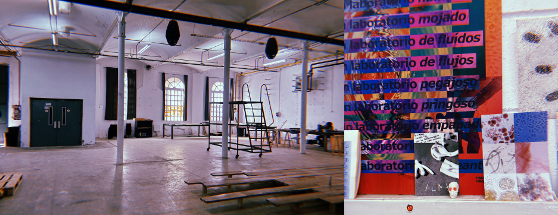
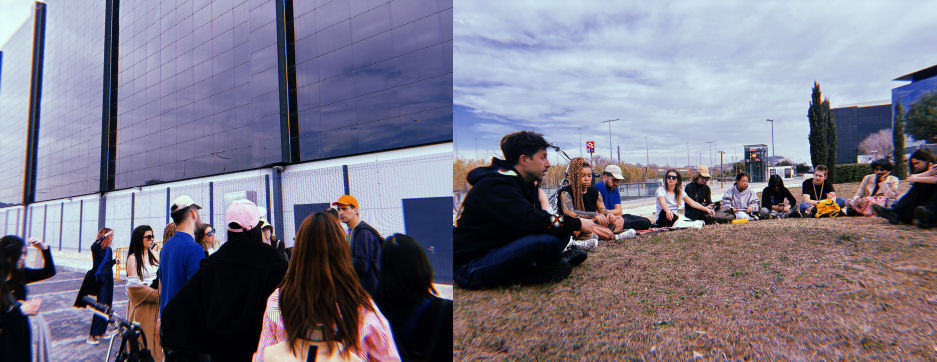

---
hide:
    - toc
---

# Future Talks

## Design with Values

###  Contents
During this talk, I've had the opportunity to reflect on Distributed Design and designing with values. Since the beginning of the master's program, we've been exploring new ways of designing with fresh perspectives for emerging futures and learning about new technologies and mediums for innovation. However, after a trimester, I feel I've lost some sense of direction regarding whom we are designing for and with whom we are designing. This conference on Distributed Design and designing with values has allowed me to step back and view my project from an external perspective. I've realized that my projects in the first trimester were primarily focused on the concept of identity and were therefore quite egocentric. Moving forward, I may need to develop projects that prioritize mental health and identity but decentralize this concept not only in a European context but also aim to be socially sustainable and responsible.

While it may be challenging to maintain sustainable consciousness, considering my project ultimately revolves around artificial intelligence technologies, I aim to prioritize humanism and equity concepts. Therefore, I aspire to pursue ethical and equitable innovation.

###  Reflections

**- What are the key takeaways from the activity?**
During the presentation, we learned about the Distributed Design Platform called Reflection Tree. Essentially, it's a tool that helps you review your own projects and practices. I used this tool to evaluate a project I worked on in the first trimester, which was about digital identity and artificial intelligence. Clearly, this project was more about my personal exploration into AI and identity. I didn't expect it to impact society but rather to affect my own understanding and approach to the topic. Using this tool made me realize that my previous projects related to AI and identity have been quite self-centered and subjective. I may need to reconsider how I approach my projects. While it's challenging to connect AI to sustainability, I could strive to make my projects more open and collaborative. For instance, if I develop technology to enhance societal identity, it should be accessible to everyone. Additionally, discussions on mental health identity could involve collaboration with diverse communities and embrace regenerative practices and inclusion.

**- Feedback of  the Reflection-Tree?**

Besides this, I find this tool quite useful, but it's somewhat subjective. I believe if someone who worked on the same project with me were to evaluate these values, they might think differently. Therefore, it's challenging to measure all these values objectively. However, it's a great tool for self-reflection and to determine the values we are truly applying. As designers, we often focus so much on solving problems that we sometimes forget who we are designing for and what our objectives are. This tool has helped me reevaluate that ultimately, the projects I undertake are meant to help others, not just to prove something.

Additionally, I think this tool is extensive and should be focused on long-term projects. I evaluated a project that lasted only a week, so it was challenging to deeply analyze its values. It was more of a tool to aid my journey as a designer in the master's program rather than a project with significant impact. Therefore, it would be better to apply this tool to the master's thesis rather than the smaller projects we've been doing throughout the course.

## Networks of Co-Responsibility

###  Contents
In the second Future Talks, we visited Hangar's Wet Lab, located at the Can Ricard headquarters, an industrial environment in the Poblenou neighborhood of Barcelona. There, we were presented with the facilities and introduced to the lab. Additionally, we had a conversation with an Hangar creator and were shown the various possibilities and projects undertaken in this space. While we didn't extensively explore all available areas, we engaged in discussions in one of the spaces about different projects. It was evident that Hangar aims to support creators in all phases of the visual arts production process and contribute to the successful completion of each project. They actively promote knowledge transfer while maintaining respect for communities and both human and non-human entities, acknowledging the lab's wet, sticky nature.

###  Reflections
Personally, this visit didn't impact me much, as from what I observed of Hangar, they have a very creative way of visualizing and communicating ideas, questioning a society centered on humans. Their aim is to respect non-human entities and foster a laboratory of respect and collaboration. While I appreciate these values and believe they should be promoted more in any scientific study or collaboration, my master's thesis focuses more on technology, artificial intelligence, and its impact on mental health. Therefore, I'm not as focused on this type of non-human collaboration in societies.

**I did enjoy seeing the projects they were working on, and especially appreciated the future newspaper they provided, which served as great inspiration for visualizing and contextualizing the future in our projects. However, Hangar's focus on collaboration doesn't entirely align with the nature of my project, which is heavily centered on humans and identity, making it somewhat egocentric and selfish. Additionally, my research involves aspects of neurology that already entail experimentation with animals, which, despite my admiration for Hangar's work, creates a bias as I draw inspiration from projects that don't adhere to this collaboration with non-human entities.**

Nevertheless, I believe Hangar deserves admiration, and it would be beneficial for me, if I delve deeper into neurology, to promote studies that don't rely on animal experimentation, as I find it unethical. However, since my research currently involves reading articles and understanding contemporary neurology practices, I'm not delving deeply into the values Hangar upholds.

## Internet Tour & Radical Situatedness (Flows, Knowledge and Infrastructures)

###  Contents
During our most recent Future Talk, **we embarked on an Internet Tour, where we were introduced to the hidden world of Internet and technology infrastructures in different areas of Barcelona. These infrastructures enable our daily connectivity to the Internet.** The tour provided insights into teletechnologies, unveiling the physical world of the Internet as an infrastructure. We visited non-touristic spaces, observing companies and installations that contribute to the Internet world.

Furthermore, **we attended a talk by Bani Brusardin, an educator and researcher interested in digital cultures and political technologies. Specifically, we discussed artificial intelligence and its consequences, focusing on its effects on society.** During the conference, we explored the synthetic versus factual aspects of AI and society's perceptions and opinions regarding it. 

What I gather from the talk was that in recent years, significant developments have occurred in artificial intelligence and its applications. The most pressing question we face is the role society will play and how we will adapt to this technology. Importantly, we recognize that it's not solely about technology adapting to us, but also about us adapting to it. We must change society to utilize this technology as a tool, but with caution, as AI is evolving independently and creating synthetic minds. As a society, we need to be aware of and manage these developments, ensuring that humans can use these technologies as resources rather than being absorbed by them.

###  Reflections
####  Internet Tour
Personally, I found the Internet Tour interesting, but it didn't captivate me entirely. It's true that we often overlook the physical aspect of the Internet and its consumption of energy and physical space in the world. I had never considered where the cables connecting us to the Internet are located, and realizing that they are often housed in existing pipelines near our homes was surprising to me.

Moreover, it was astonishing to see how closely connected all these spaces are and how the entire Internet infrastructure sometimes depends on just one building. It made me reflect on the fact that such a vast world, upon which we as a society rely and often take for granted, is centered on such a small physical space, where millions of people depend on it. **This reflection highlighted the concept that the world of technology and the Internet will always rely on physical space and require physical resources. We must be aware that every use of the Internet consumes energy and occupies space in our world. This realization prompted me to reconsider our relationship with technology and our responsibility to use it sustainably.**

####  Radical Situatedness
My discussion with Bani during our recent Talks session was particularly engaging, especially considering its direct relevance to my thesis topic. Exploring how we should adapt to advancing technology and delving into concepts of creativity and our evolving relationship with artificial intelligence (AI) was thought-provoking and something we should collectively address as a society. Bani's statement about AI being a mathematical tool designed to minimize errors, yet acknowledging anomalies as normal, resonated deeply with me.

The conversation prompted me to reflect on the concept of individuality amidst an increasingly digitized world dominated by zeros and ones, perfection, and predefined categories. It's becoming a challenge to maintain our human essence in a society where we're heavily reliant on databases and automated processes. Additionally, I found the discourse on intellectual property rights concerning AI-generated content quite intriguing.

**The key takeaway for me was the notion that while we should embrace AI as a tool, we must also acknowledge its potential pitfalls and biases. Despite our attempts, we cannot fully control its trajectory, as AI evolves at a pace surpassing our adaptation abilities. Therefore, our focus should shift towards adapting our societal structures to accommodate and guide the responsible use of AI.**

It's evident that AI integration into various fields, such as graphic design, will reshape traditional learning approaches. Rather than starting from scratch, we must teach how to integrate AI tools effectively while retaining the essence of human creativity.

While accepting the inevitability of AI's role in our future, I'm wary of complete dependency. There's a risk of losing our ability to think critically and independently if we solely rely on AI-driven solutions. Thus, we must explore ways to balance technological advancements while nurturing human cognitive abilities.

**In essence, my concern lies in how we prevent ourselves from becoming too reliant on AI and retain our capacity for critical thinking and ethical decision-making in an increasingly automated world.**

