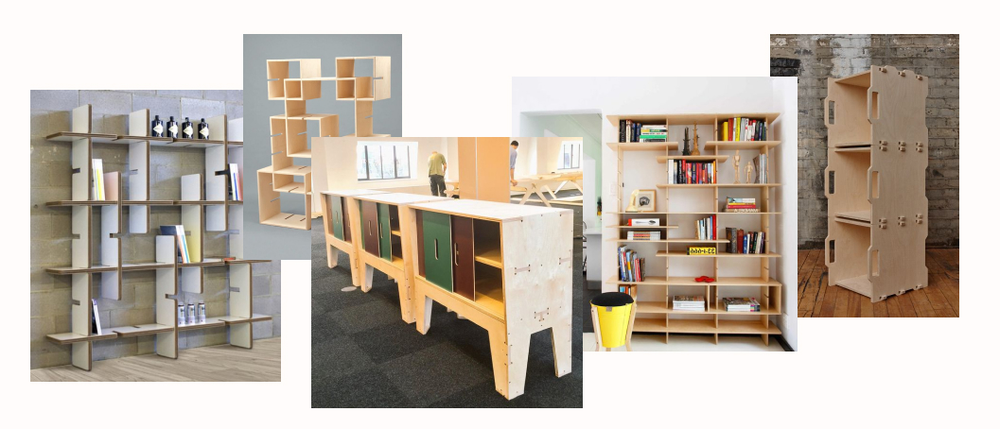
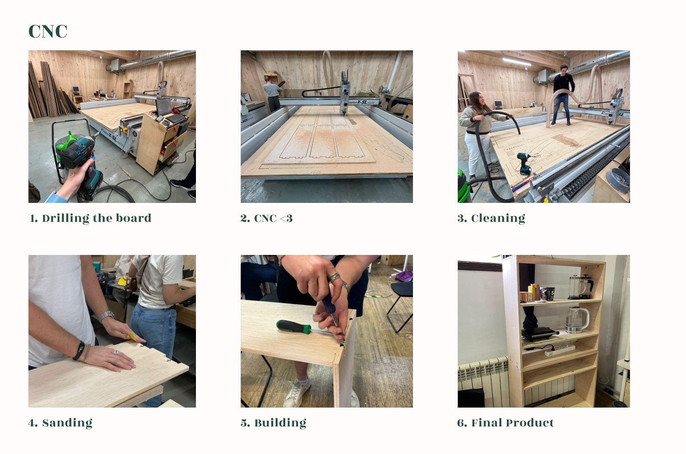

---
hide:
    - toc
---

# Digital Prototyping for Design

## 2D Fabrication
> Theater Stage made from Biomaterials

> Núria Valsells and Carmen Robres

### References
 

### Process
{style: width="520"}

**Final Product**

**Short Video of the process**
<iframe width="560" height="315" src="https://www.youtube.com/embed/0cLL_Nu7nfY?si=5yCwepf1wE0ZHRyy" title="YouTube video player" frameborder="0" allow="accelerometer; autoplay; clipboard-write; encrypted-media; gyroscope; picture-in-picture; web-share" allowfullscreen></iframe>

### Reflection: The four F’s of active reviewing
 *Facts:* 

- We opted to craft a theater using biomaterials molded with laser cutting because we lacked time for proper drying to use a laser cutter directly. So, We created a mold from laser cutting and let the materials dry naturally
- We had to try twice; initially, we omitted glycerol from the gelatin to keep it rigid, unaware that adding this would cause it to overdry and bend. Although it initially met our rigidity needs, it continued to dry, causing the edges to lift, failing to achieve the desired flat effect.
- In our second attempt, we added glycerol and covered it to prevent rising during drying, but this led to mold formation due to the biomaterials being covered. 
- Despite the limited mold formation on one side, we proceeded as the texture met our requirements. To hang it correctly, we glued the material to acrylic scraps to maintain rigidity (the material did not complety dry so it was a bit fragile), then hung it.

 *Feelings:* 

 - We were disappointed to have to try twice and found that the mistakes were quite common. Firstly, we simply forgot to add glycerol in the first attempt, and in the second, we didn't anticipate that covering the biomaterial and depriving it of air would lead to mold growth, especially since it was in contact with an improperly sealed piece.
 - Additionally, we felt bad because we had to use acrylic for drying the gelatine, which is an expensive material, and that didn't sit well with us since our product had no functional value.

 *Findings:* 

- I've acquired skills in laser cutting and creating biomaterials. 
- I've come to understand that biomaterial recipes are straightforward, yet achieving the desired strength and texture takes time. 
- It's important to reflect on how to maximize material usage in projects.

 *Future:* 

 - The initial try at producing a biomaterial is never final. Therefore, it's advisable to experiment on a small scale beforehand, testing various textures, colors, and drying durations, before settling on the ultimate material.
 
 [Fabrication files](https://drive.google.com/drive/folders/1ePaPlaMClO6WwB8KC66vz0l6MqG6qOfN?usp=sharing).

## 3D Printing
> Ashtray. Design and 3D print a mould to grow your own materials (Mycelium).

> Núria Valsells and Carmen Robres

### References
 

### Process
{style: width="520"}

**Final Product**

After 3 weeks, we finally removed the mycelium from the mold. It had grown extensively and remained uninfected. While it did take on the desired shape, it didn't grow exactly as we intended. Perhaps if we had allowed it more time to grow, it would have taken on the intended shape with all the desired details.

### Reflection: The four F’s of active reviewing

*Facts:* 

- The printing process was quick as we didn't need to create any new documents or designs; instead, we used one already available online. It took approximately two hours to complete the printing.
- Creating the mycelium ashtray was time-consuming due to the need to disinfect all the materials, which took about 50 minutes.
- Our initial plan to use ashes in the recipe couldn't be realized because we intended to collect the ashes on the same day, but it rained. Consequently, most of the ashtrays had wet ashes that formed a paste, which we decided not to use.
- Setting up the printer was challenging because it was not properly calibrated. It took three attempts before we realized the printing error, and after cleaning and recalibrating it, we managed to print.
- It took 3 weeks for the mycellium to grow.

*Feelings:* 

- Printing and troubleshooting the printer was an intriguing experience, especially because I had never attempted 3D printing independently before.
- The initial malfunction of the printer turned out to be a blessing in disguise, as it provided me with an opportunity to analyze and manage the issue effectively, leading to a resolution.
- However, waiting for the mycelium to grow is somewhat frustrating, given the uncertainty about the accuracy and functionality of the mold we printed.
- The finalized design is not suitable as a functional ashtray since it is too small.

*Findings:* 

- My limited experience with 3D printing and Mycelium cultivation has been a significant learning curve throughout this project. I've gained valuable skills in the topic since they were previously unfamiliar to me.
- I was unaware of the extensive time required for mycelium growth and the complexity involved in understanding its growth process.
- Not only is growing mycelium demanding, but comprehending its growth and evolution entails a substantial amount of time and dedication, resources that were limited in this project.
- I was surprised by the necessity of thoroughly disinfecting all materials used in the mycelium cultivation process.

*Future:* 

- In the future, I aim to experiment with creating mycelium using diverse materials, going beyond the standard recipe by incorporating elements such as ashes.
- I'm interested in exploring the growth of mycelium, letting it expand naturally instead of restricting it to molds we've designed, and discovering its potential applications.
- Additionally, I aspire to acquire skills in designing molds that can adapt to mycelium growth, enabling us to craft ashtrays that are more personalized, authentic, and innovative.

 [Fabrication files](https://cults3d.com/en/3d-model/home/drop-ashtray).

## CNC Furniture
> Modular Shelf. 

> Núria Valsells, Oliver Lloyd and Carmen Robres

### References

### Process
At first, we had to make several changes to the product design. Initially, we attempted to create a modular and large shelving unit. However, we soon realized that we didn't have enough wood to construct a shelving unit made up of four blocks. Therefore, we opted to create an L-shaped structure to reduce the amount of wood needed. 

This design better suited our requirements and the available materials. However, when we presented this design for cutting, we were informed that it lacked balance due to excess material on the sides, and it didn't guarantee stability. Consequently, we redesigned the structure to consist of cubes, small squares that could be added both vertically and horizontally. 

This time, we focused on just two blocks instead of three and incorporated further structural changes to ensure balance. We transitioned from using pressure-based joints to employing a T-joint system, which required screws and washers to secure the pieces together. Additionally, to insert the shelves into the cubes, we utilized a typical Ikea-style system where holes were drilled, and small wooden pegs to support the shelves. 

However, we encountered two structural issues: the initial design was intended for a CNC M4 machine, which was broken, necessitating a design change, and the male-female joint configuration was modified to ensure structural integrity by making each piece have both male and female sides for better grip and stability. These adjustments were made, and we were finally able to print and cut using the CNC machine.

Finally, we proceeded to cut with the CNC. We encountered only one error, which occurred when programming the CNC: we positioned the material incorrectly. As a result, during the transition from engraving to cutting, the CNC slightly went over the material. Essentially, it cut the wood when it shouldn't have while moving. To rectify this, we stopped the machine and corrected the error so that when it returned to zero, it moved upward this time.

Additionally, we had a minor oversight: the wooden pieces needed to be positioned perfectly. When inserting the screws, we should have drilled slightly smaller holes to ensure better fixation. Nonetheless, the final product turned out perfectly. My reflection would be to explore ways to connect the two modules, perhaps using 3D printed pieces or similar solutions.

### Reflection: The four F’s of active reviewing
*Facts:* 

- We had to redesign the product three times to improve its stability.

- There was a minor error in the CNC, but it was corrected.

- The most complex part was the design and the tolerance to consider, taking into account the tools that had to be used and the CNC itself.

 *Feelings:* 

- Initially, I thought the CNC would be intimidating, but after redesigning the product 3 times, I gained confidence knowing it would cut well.

-  This process helped me understand better how it works and gave me much more assurance, not only in the design process, which is also complex due to speed and tolerance issues, but also because it's a large machine that commands respect.

- Despite encountering errors, we were finally able to create a correct and functional structure.

 *Findings:* 

- I learned various methods of joining, which I believe will be valuable in the future.

- The experience also taught me to derive confidence from it and explore different ways to create stable products.

 *Future:* 
 
- I aim to utilize the CNC more in the future.

- Additionally, I envision using 3D printing to create parts that can join the sides of the structure, ensuring better quality and stability.
 
 [Fabrication files](https://drive.google.com/drive/folders/1NmSh28hcguX5nGBE1HpGVCuo5WYQRLI6?usp=drive_link).

