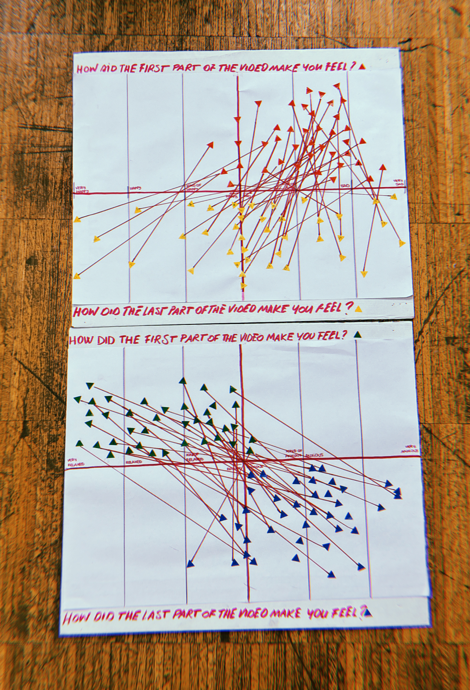
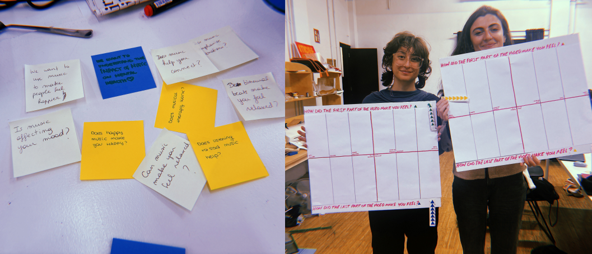

---
hide:
    - toc
---

# Measuring the world

## Project: Let's get physical

###  Contents

{style: width="480", align=right}

**In this course, we immersed ourselves in the realm of data, exploring tools for documenting, storing, and analyzing information.** During an exercise, we competed for tools relevant to our project theme – understanding the impact of music on emotions and social connection. The options included Arduino, a SmartCitizen Kit, physical intervention tools, and cameras. While cameras seemed more challenging and interesting for our project, we opted for physical intervention, better suited for our focus on emotions and music.

Our project primarily involved data collection, where we presented people with a series of videos. These videos evoked visual emotions and had background music that matched the visuals. Midway through each video, the music abruptly changed to an unrelated song, and we observed the change in people's moods. This project greatly helped us understand data collection, especially in the subjective realm of emotions, which are challenging to measure accurately. **It was challenging to guide people through the voting process as we limited responses to streamline our study. However, numerous factors interact with emotions, making it difficult to ascertain whether individuals genuinely felt happy or not.**

**In conclusion, we were able to test our hypothesis that music indeed influences mood changes.** However, various factors influenced our data collection, making it challenging to determine conclusively whether the music we selected was the sole reason for people's mood changes. Additionally, the data collection spanned only two days, limiting the formation of a well-rounded conclusion. Even though we observed mood changes, it does not explicitly confirm that the chosen music was the cause.

If you want to see the actual technical parts and process of the activity, you can read our [Journal.](https://hackmd.io/XC00gQSFT9SQP1POiJPHgA?both)

###  Presentation

  <iframe loading="lazy" style="position: absolute; width: 100%; height: 100%; top: 0; left: 0; border: none; padding: 0;margin: 0;"
    src="https:&#x2F;&#x2F;www.canva.com&#x2F;design&#x2F;DAF8SojQySw&#x2F;F-ctR9KF_G1oswEQUDf-LA&#x2F;view?embed" allowfullscreen="allowfullscreen" allow="fullscreen">
  </iframe>

<a href="https:&#x2F;&#x2F;www.canva.com&#x2F;design&#x2F;DAF8SojQySw&#x2F;F-ctR9KF_G1oswEQUDf-LA&#x2F;view?utm_content=DAF8SojQySw&amp;utm_campaign=designshare&amp;utm_medium=embeds&amp;utm_source=link" target="_blank" rel="noopener">Let’s get physical</a> de so.marandon

## Reflection
I've been highly intrigued by this course, given that my thesis revolves around artificial intelligence and technology usage. At present, my goal is to create an artificial intelligence clone of myself that can react to my instructions and mimic my behavior. However, a significant challenge I've encountered is the accurate collection of data, a crucial aspect for feeding this artificial intelligence.

**The seminar on this subject has captured my interest, and I'm eager to delve deeper into it. Data collection fascinates me, and the opportunity to explore various tools that are new to me, while also engaging more with technology, is quite appealing. Although I utilized a physical tool for a previous project, I would have preferred a more tech-oriented data collection approach with technological components like cameras, aligning with the focus of my thesis.**

Additionally, I'm keen on further exploring the realm of APIs to gather data not only about myself but also about others. I'm particularly interested in delving into the concept of sensors and understanding how to capture information from our surroundings. Currently, my primary focus is on developing technology that responds to our emotions and personalities, necessitating a robust database and precise data analysis to comprehend the reactions to the detected actions and gain insights into our surroundings.