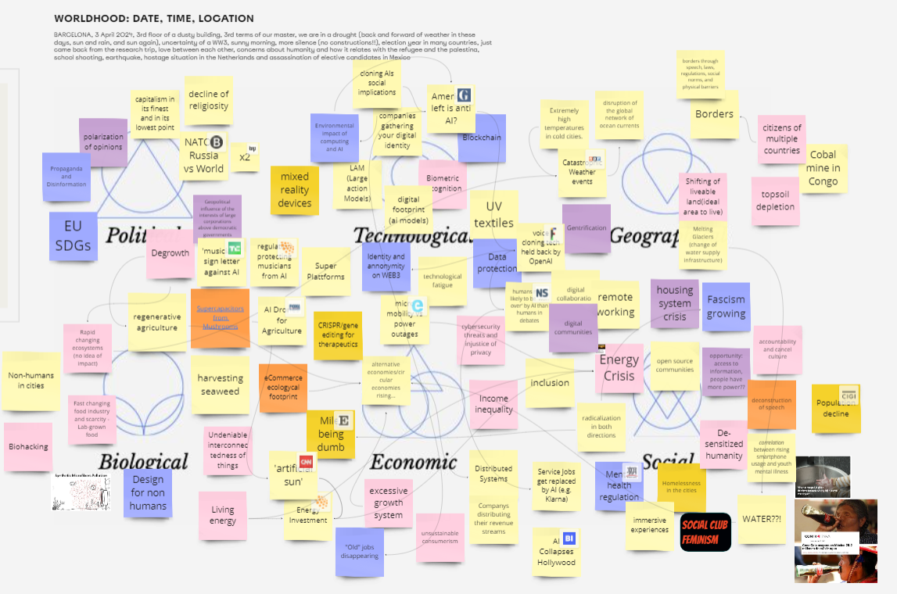
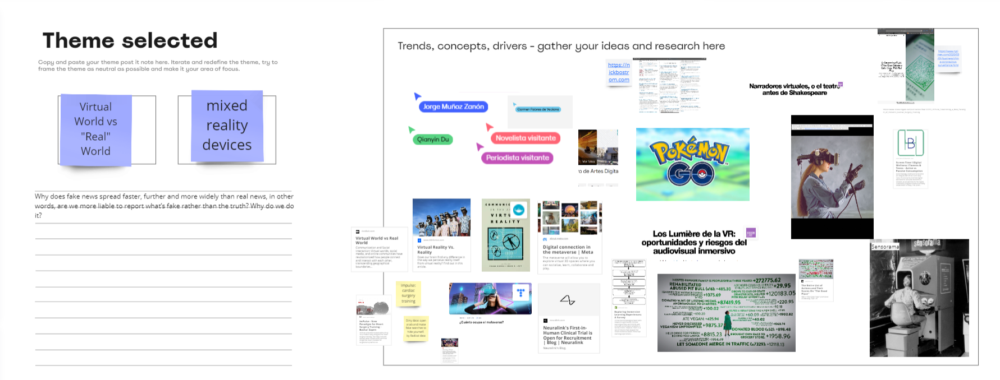
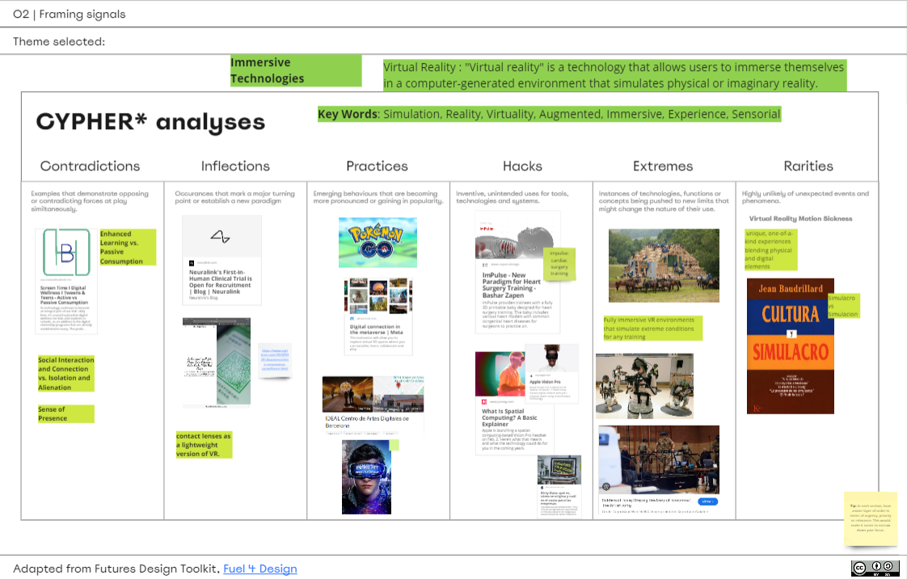
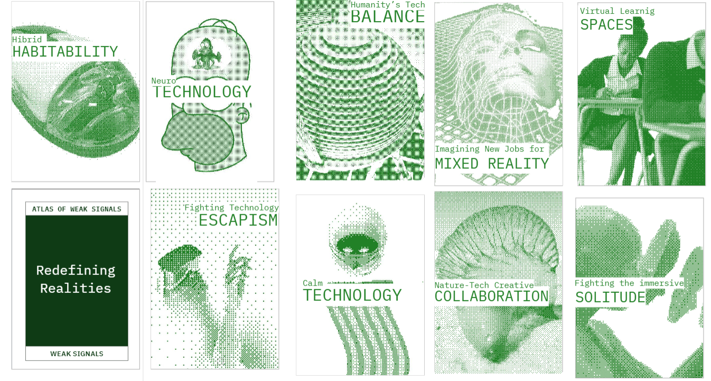
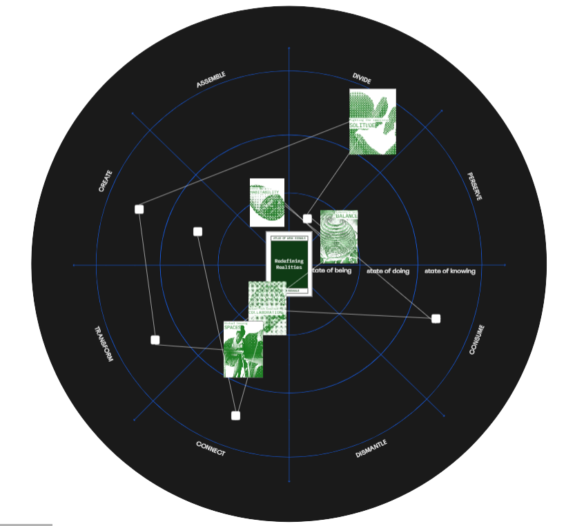
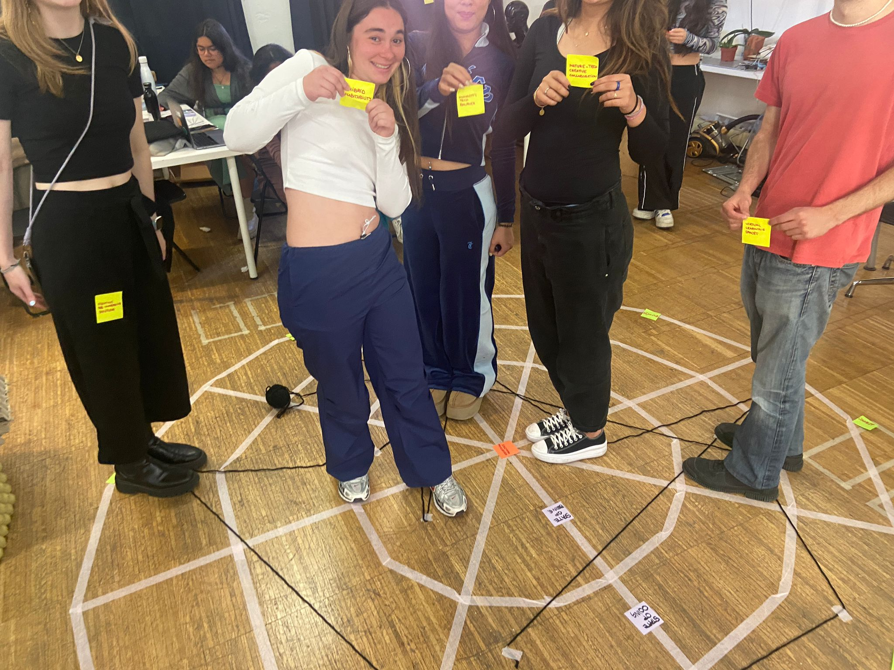

---
hide:
    - toc
---

# Atlas of Weak Signals

## Contents
During this seminar, we attempted to create and design various weak signal cards. Let's recall that a weak signal is the detection of evidence of an emerging change within a continuous process of exploration in a specific environment. Therefore, these are discrete, often ambiguous, emerging, and incipient indicators that may herald a potential change or crisis. This seminar served to generate new cards on these weak signal themes for the future, offering novel perspectives.

### Activity 01
In the initial exercise, we mapped out our current situation in the world, including our location, time, and date. Then, we brainstormed various ideas in the political, technological, geographical, biological, economic, and social realms. It was quite interesting to do this draft because we conducted a small brainstorming session of all the things we knew that could potentially be topics for the Atlas of Weak Signals. This preliminary phase was very fluid, as we all interact with various issues and topics in our daily lives. **Our goal initially was to try to maintain a positive outlook, avoiding just writing down negative and socially frustrating topics.** Instead, if we were going to create Weak Signals cards, they could be positive or neutral, not necessarily focusing solely on negative themes. Ultimately, we could envision futures that take into account positive aspects as well.

### Activity 02
Once we settled on our theme, which we chose as a group within the realm of technology, narrowing down the topic became a bit challenging. As we discussed within our group, we realized that our interest lay in exploring the virtual world, encompassing augmented reality, virtual reality, and the future implications of the virtual world on jobs, ideas, and our interactions within it. We pondered whether being in different virtual worlds made us different individuals or if we were all part of one overarching digital reality. While reflecting on it now, I see that this may not fit the criteria of a weak signal. However, our hope was that from this initial exploration, we could refine the theme further. **Essentially, we were delving into the concept of the digital reality and the diverse realms we have created through technology, including the various identities we inhabit and the possibilities arising from this duality.**

### Activity 03
In the third activity, we focused on outlining various interpretations of our theme. We aimed to provide different examples of practices, hacks, and contradictions within the realm of virtual reality. When it came to providing examples, we found it challenging to grasp the concept of technological immersion. We had to consult the dictionary to define terms like virtual reality, simulation, virtuality, augmentation, immersion, experience, and sensory. For me, the most significant aspect was recognizing practices such as Pokémon Go, which emerged a decade ago, as instances of these parallel realities in which we coexist. Extremes included augmented realities used for military training in the United States. Additionally, rarities represented a blend of physical and digital elements. **However, specifying these ideas proved challenging, as we all had different notions of various practices and contradictions. One notable contradiction in the realm of immersive technologies is the irony of creating technology for good that ultimately harms us—the ultimate paradox.**

### Activity 04
Finally, in Activity 4, we designed various cards within the concept of "Redefining Realities." While this may not be the weakest signal, it's significant. Essentially, we brainstormed potential themes affecting these parallel realities. For instance, we explored neurotechnology, which challenges the notion of two parallel realities, and combating the isolating nature of immersive technologies. Our cards ranged from concepts involving the fusion of physical and technological elements to how we'll navigate coexistence with these technologies. We also considered how we'll learn using these tools and reimagine jobs, finding a balance between nature and technology in the realm of immersive realities.

{style: width="380", align=left}
### Activity 05

Once these cards were created, we attempted to position ourselves on the canvas to understand which areas of this circle our cards interacted with. The Weak Signal of "Redefining Realities" is closely tied to how we exist, our ways of being. Secondly, it influences how we do things, and finally, how we understand. Most often, we concluded that these technologies affect not only our ways of being but also how we connect with others, sometimes even dividing us. Therefore, it was clear to us that these Weak Signals change our identity and our way of connecting with others, as well as how we consume.

 Get access to our [Miro Board](https://miro.com/app/board/uXjVKdjPEuY=/).

## Reflection
{style: width="480", align=right}
It was fascinating to be part of this activity, as it felt like a kind of pause from the fast pace of the master's program. For the first time, we were doing something to help others instead of constantly absorbing information from our professors. This was a moment where we shared our knowledge to collectively create something. It was also interesting for me to step outside the realm of mental health and identity and explore more technology-related issues, which still play a part in my master's thesis, but aren't exactly the main focus. Using this methodology was quite enlightening as it was well-mapped for brainstorming, and I believe it's a valuable exercise, meticulously structured. However, creating these weak signals was challenging for me, as I still struggle to grasp the concept itself. Given that these topics are likely to change annually, it's difficult to discern which themes are currently weak signals that could potentially develop. Nonetheless, I found it very intriguing, and I would love to see which of the generated cards end up being part of the deck. Additionally, the interactive exercise was engaging, and I definitely look forward to using such brainstorming structures to create different projects in the future.
