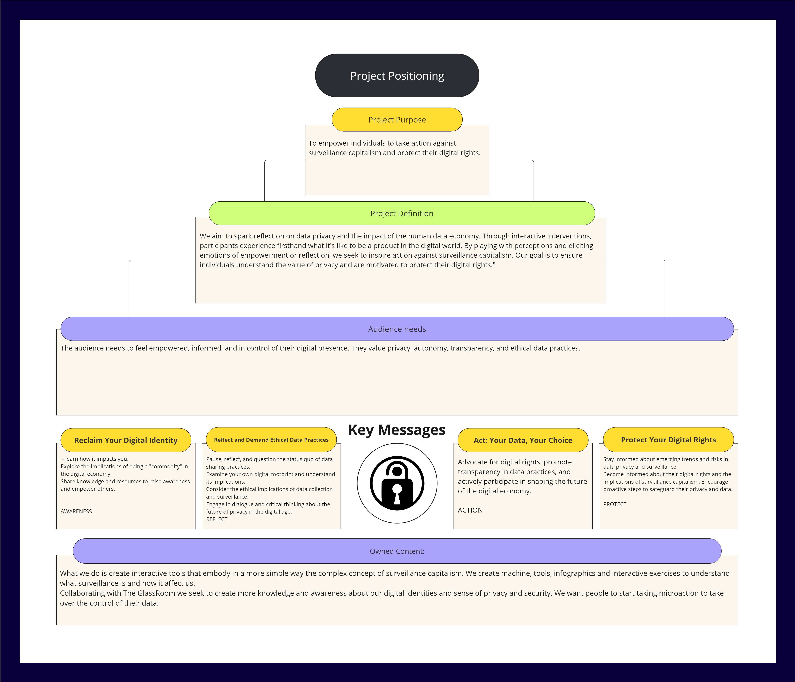

---
hide:
    - toc
---

# Communicating Ideas

## Project Positioning

I've struggled a lot to position my project because I've changed topics quite a few times. Honestly, I think I've chosen a very broad topic, and finding the right tone has been challenging. Communicating it has also been complex. This quarter, for me, has been mostly about revisiting all the exercises we've done before and trying to summarize all the ideas I have into a simplified communication technique. 

**In the end, I think I've managed to find the right tone and also the way to inform because ultimately all I want is to explore surveillance techniques and different ways to communicate the amount of data collected about us.** Since I've just started with the topic, I don't have any practical exercises or workshops to execute yet as I'm still in the phase of learning and understanding what's around us. Therefore, I'm exploring existing tools and I want people to learn how to use them too. 

**My current goal is to make people understand the extent of the surveillance concept and to create a way to fight against it together, either by fighting within the system or by trying to find ways to protect ourselves in terms of digital rights.** Therefore, finding a position has been a bit complicated, but I definitely think I've finally achieved it since my ultimate goal has always been communication through interactive tools and interactive posters. **So, my stance and tone have always been about sharing everything I'm learning and exploring with technologies to enhance and understand this communication.**

 

### Website
Regarding the website, I've mainly focused on explaining what I've done so far, which is two months of exploration. I haven't wanted to delve much into what the MDEFestival is because I'm still not clear on what I am going to do or how to express it, and I'd like to add images after the final presentation. 
Overall, my tone is communicative; I simply want to explain what I aim to explore. I don't want to brainwash anyone, so I'm not going around preaching that we all need to fight for privacy. **What I want is simply to convey that privacy is important and to share all the efforts I've made to either demonstrate it or advocate for it. My goal for my website is for people to understand my thesis, my exploration, and what I've done with it, and essentially to get a sense of what others might want to explore. If they're interested in continuing the conversation on the topic, then they can contact me.**

  <a href="https://carmenrobres.github.io/portfolio/thesis/01-InitialIdea/" style="display: inline-block; padding: 10px 20px; font-size: 16px; color: white; background-color: #E17858; text-align: center; text-decoration: none; border-radius: 5px;">
    Explore my thesis website
  </a>

### Social Media

For now, my communication strategy will be based on Instagram, as I believe the rest of the audience I need to reach are businesses to whom I need to present conclusions. That is, we want this type of data protection or once we've spoken with the public, understand their needs and then communicate with other individuals, companies, and the government about what we need. Therefore, the first step is simply on social media, trying to raise awareness among people. That's why I've decided to use an Instagram account. **Initially, the first posts will mainly focus on explaining various aspects of surveillance, so that people gradually build a knowledge base and then engage in speculation. Here, I'm sharing different images I plan to use for the feed. Some are copied from other accounts because I still need to develop my own image, but gradually, I'll be posting these images along with their accompanying texts.**

**My Feed**

 

**My Posts**
 

### Reflection
Looking back, I find this course, especially its final segment, immensely valuable for bringing clarity to my ideas. Shifting between topics is no small feat, and I've come to realize that the subject I initially chose is quite broad and challenging to articulate. Crafting the appropriate tone and aiding others in grasping the complexity of the issue is equally daunting. 

These exercises have served as a guide, helping me navigate how best to convey my thoughts and ideas. They've also assisted me in mentally organizing my approach, allowing me to chart out my next steps for project advancement. While I've established a communication tone for now, I recognize the need for continued exploration. I anticipate gradually transitioning from Tools of Surveillance towards topics like Artificial Intelligence and Machine Learning applied to prototyping. Thus, I understand that my communication style will evolve over time. Presently, I'm focused on delving into surveillance communication, but as I progress, I foresee my Instagram account morphing into a platform for AI tools designed to streamline processes always taking into account data privacy and ethical tech.
