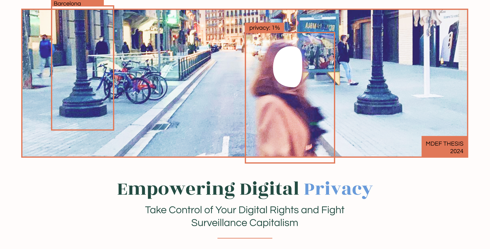
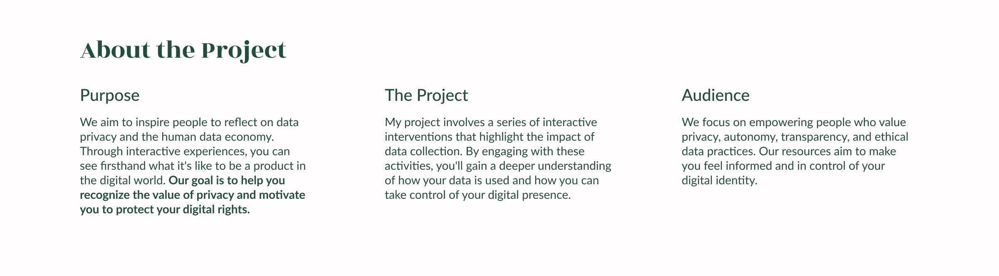
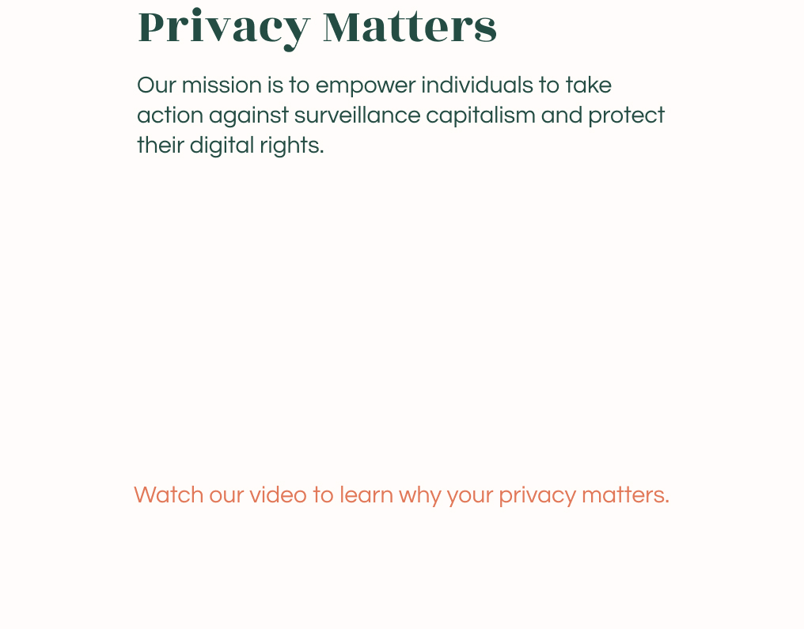
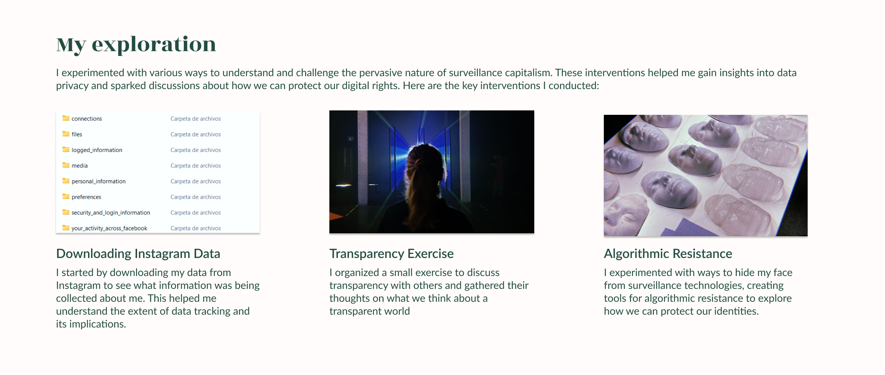
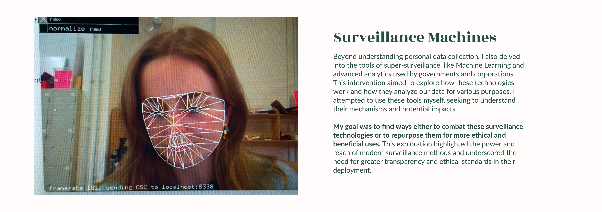
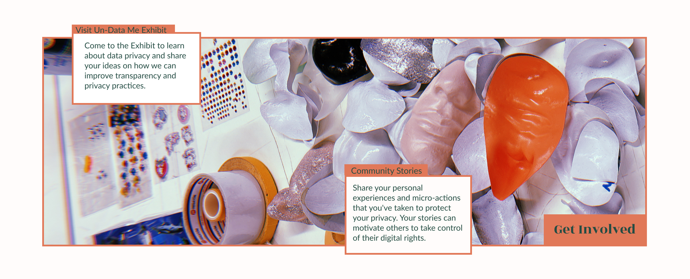
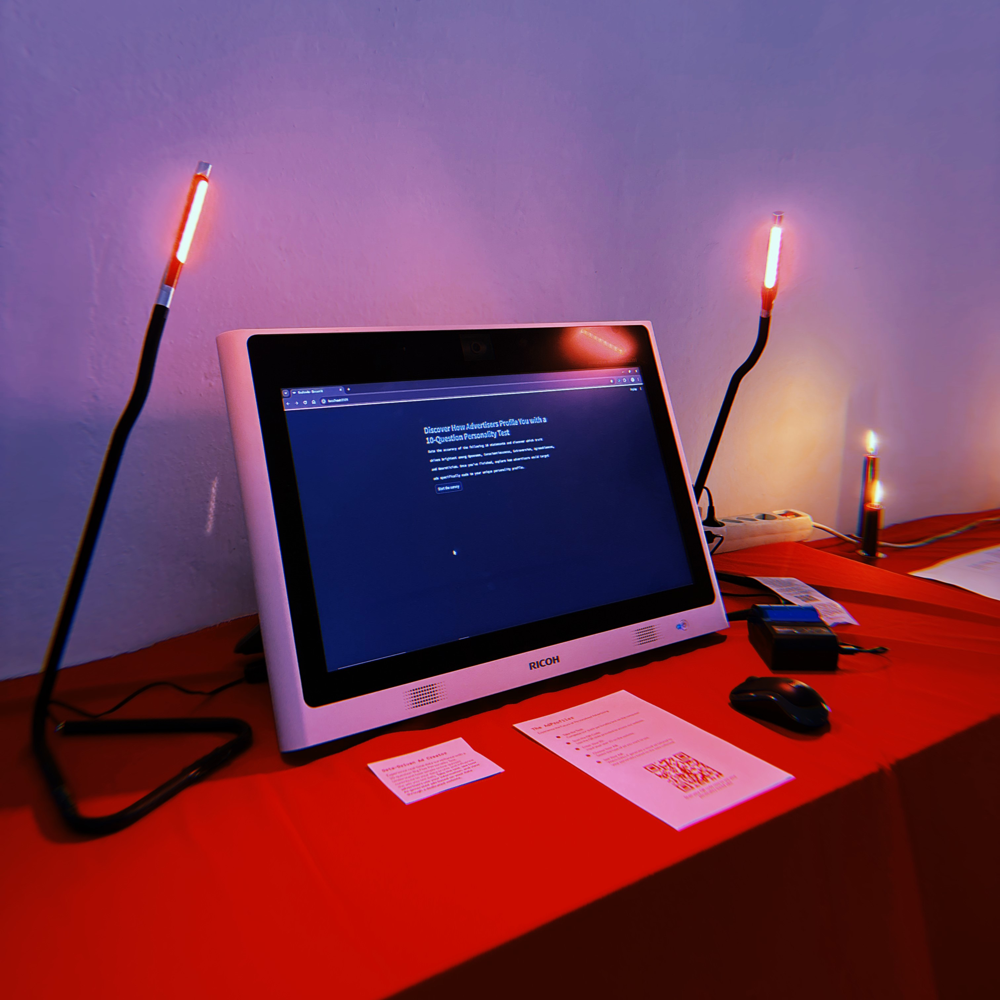
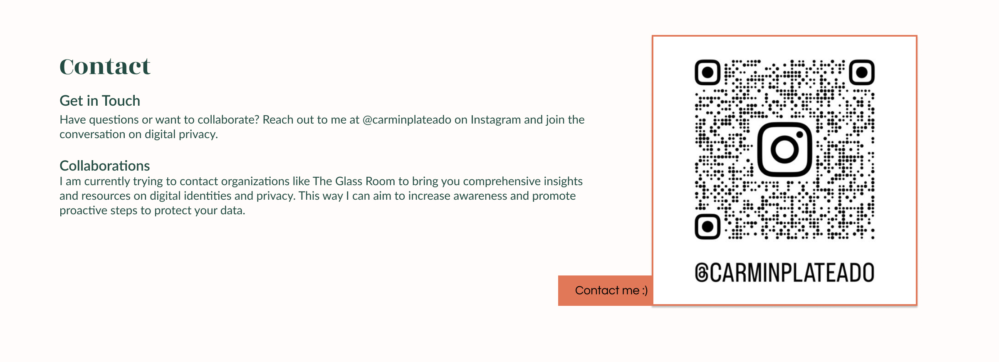

---
hide:
  - navigation
  - toc
  - title
---

#

{style: width="500", align=left}

<iframe width="560" height="315" src="https://www.youtube.com/embed/ZHOTFstByB4?si=TwWT3YzYzXLoa-Xp" title="YouTube video player" frameborder="0" allow="accelerometer; autoplay; clipboard-write; encrypted-media; gyroscope; picture-in-picture; web-share" referrerpolicy="strict-origin-when-cross-origin" allowfullscreen></iframe>

  <a href="https://carmenrobres.github.io/portfolio/03-DesignStudioF/term3/03-Intervention2/" style="display: inline-block; padding: 10px 20px; font-size: 16px; color: white; background-color: #E17858; text-align: center; text-decoration: none; border-radius: 5px;">
    Find out more about my exploration in my MDEF Journal
  </a>

  <a href="https://carmenrobres.github.io/portfolio/thesis/02-Project/" style="display: inline-block; padding: 10px 20px; font-size: 16px; color: white; background-color: #E17858; text-align: center; text-decoration: none; border-radius: 5px;">
    Find out more about my final project and the MDEFest
  </a>

