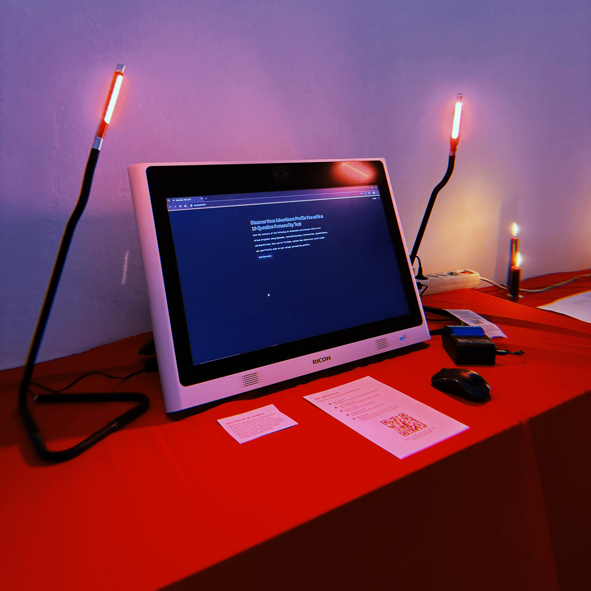
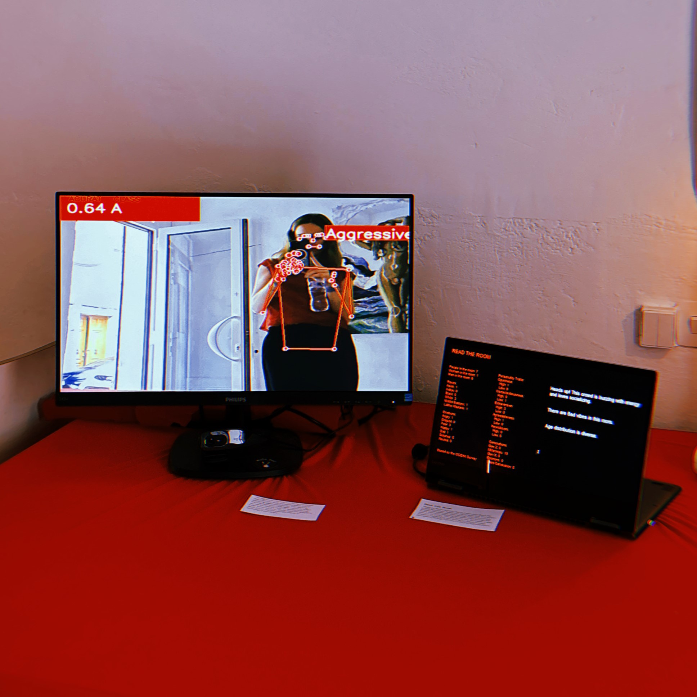
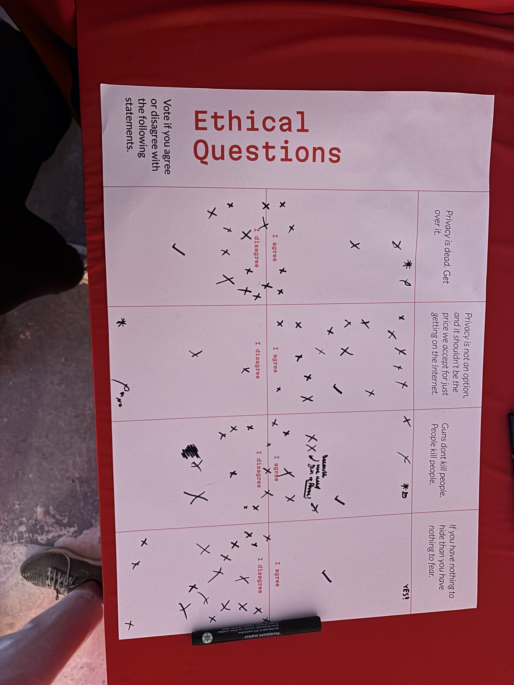

---
hide:
  - toc
  - title
---

# Unseen Exposures Exhibit: {Un}data Me

#

"{Un}data me" is an interactive project exploring data surveillance through three machines—AdProfiler, Aggressive Machine, and ReadTheRoom—designed to critique how personal data is collected and used. Surveillance capitalism commodifies personal data to predict and influence consumer behavior. These projects aim to raise awareness about the ethical implications of data surveillance and foster a critical understanding of privacy in the digital age, highlighting how autonomy is subtly undermined by data practices.

#

{style: width="400", align=left} 

### The AdProfiler
**Discover How Advertisers Profile You with a 10-Question Personality Test**

One of the key elements of this project, The AdProfiler, demonstrates the power of data collection and targeted advertising. Participants took a 10-question personality test while a hidden camera captured their image. Within minutes, the machine gathered substantial data, including personality traits, age, gender, race, and dominant emotion, to create personalized ads using AI. This exhibit highlights how quickly and accurately advertisers can profile us, raising questions about our free will in consumer behavior.

  
  

### Read The Room
{style: width="400", align=right} 

"Read the Room" displays real-time data about the people in the room based on a personality test. The screen shows the collective mood, gender ratio, extroversion levels, and more, reflecting the room's vibe through the lens of the survey data. This exhibit highlights the biases in data analytics and how businesses shape societal perceptions through their own interpretations. It emphasizes the power of data interpretation and how it influences our understanding of the environment and the people within it.

### Aggressive Machine
The Aggressive Machine is an interactive exhibit that scans body language to assess whether individuals display aggressive behavior. This machine learning experience prompts reflection on how surveillance tools can misinterpret and judge human behavior. It raises important questions about privacy and the potential misuse of technology in society. By exploring how certain countries use surveillance to enhance public safety, this exhibit underscores the potential for misinterpretation and the implications of constant monitoring.

### Ethical Questions

{style: width="480", align=left} 
As part of the project, participants were presented with four ethical statements concerning technology, privacy, and surveillance, and were asked to indicate their level of agreement:

In discussions about surveillance and privacy, a prevalent argument is that individuals with nothing to hide should not fear data collection, often comparing their perceived insignificance to more prominent figures like political leaders. However, the responses overwhelmingly disagreed with the statement "If you have nothing to hide, then you have nothing to fear." **This suggests that while people may downplay their importance in the public eye, they still regard privacy as a crucial right.**

These questions aimed to gauge participants' stances on technology, privacy, and security. The diverse responses underscored that, despite differing views on the ethical implications of AI and technological advancements, there is a widespread consensus on the importance of safeguarding privacy. **The exercise highlighted the need to advocate for privacy rights regardless of how individuals perceive the significance of their digital presence.**

