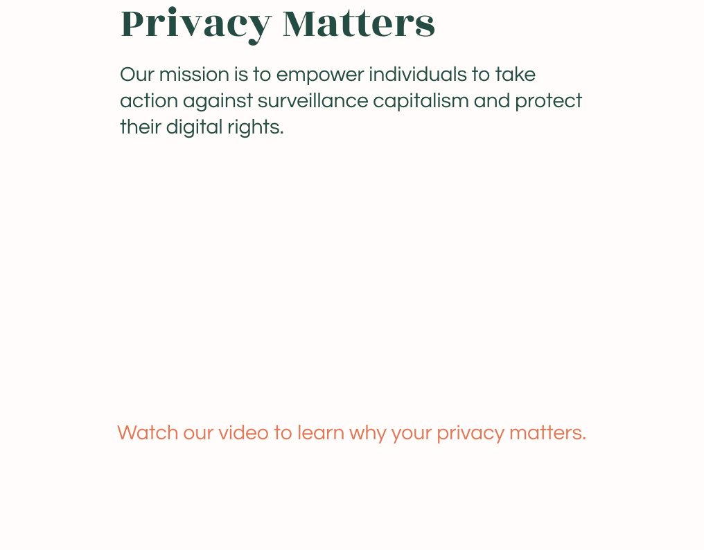
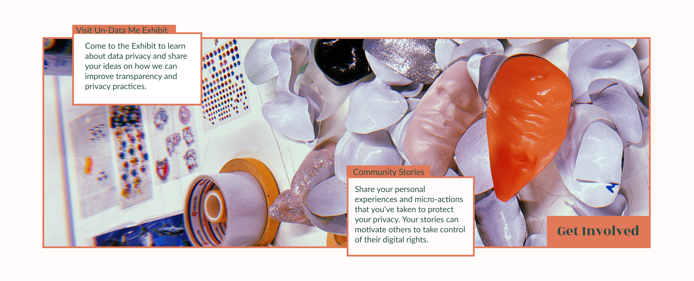

---
hide:
  - navigation
  - toc
  - title
---

#

{style: width="500", align=left}

<iframe width="560" height="315" src="https://www.youtube.com/embed/ZHOTFstByB4?si=TwWT3YzYzXLoa-Xp" title="YouTube video player" frameborder="0" allow="accelerometer; autoplay; clipboard-write; encrypted-media; gyroscope; picture-in-picture; web-share" referrerpolicy="strict-origin-when-cross-origin" allowfullscreen></iframe>

  <a href="https://carmenrobres.github.io/portfolio/03-DesignStudioF/term3/03-Intervention2/" style="display: inline-block; padding: 10px 20px; font-size: 16px; color: white; background-color: #E17858; text-align: center; text-decoration: none; border-radius: 5px;">
    Find out more about my exploration in my MDEF Journal
  </a>

{style: width="480", align=left} 

## MDEFest: Unseen Exposures
For my final intervention this year, I hosted an event showcasing my interactive machines. These machines represent the culmination of my project, where I emphasized the importance of discussing data privacy and surveillance capitalism. The event, held on June 11, 2024, featured three machines: the AdProfiler, the Aggressive Machine, and the ReadTheRoom Machine. Each of these machines embodies different aspects of surveillance, illustrating how companies simply gather data about individuals and what can be done with that data.

**The event was essentially a small exhibition where attendees could interact with these machines, view informative posters detailing the extent of data collection, and engage in conversations about data privacy. It served as the conclusion of my project, aimed at raising awareness and sparking discussions on these critical issues.**
  

  <a href="https://carmenrobres.github.io/portfolio/thesis/02-Project/" style="display: inline-block; padding: 10px 20px; font-size: 16px; color: white; background-color: #E17858; text-align: center; text-decoration: none; border-radius: 5px;">
    Find out more about my final project and the MDEFest
  </a>

